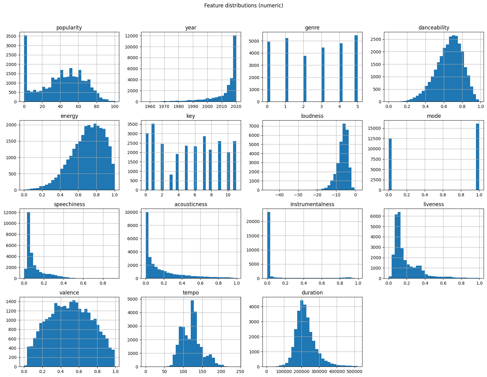
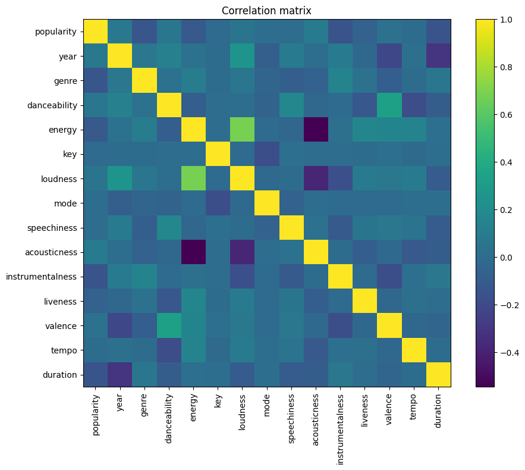
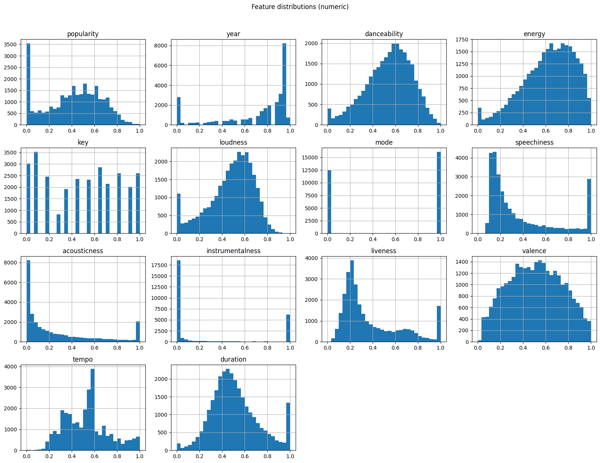
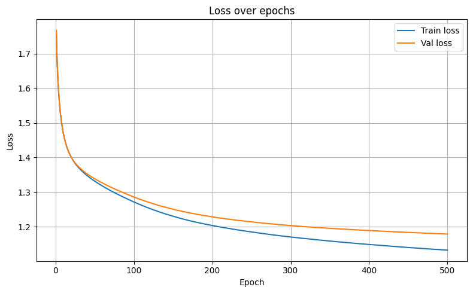
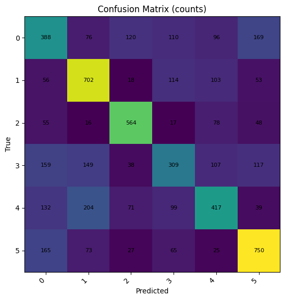
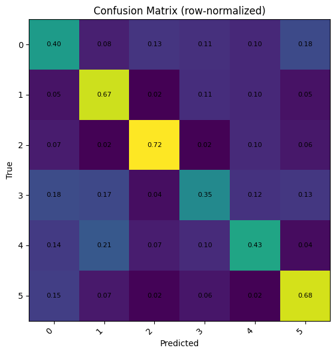

# Spotify Genre Classification — MLP Report

---

## 1. Dataset Selection

**Name:** Spotify Songs (local CSV: `spotify_songs.csv`)

**Source URL:** [30000 Spotify Songs](https://www.kaggle.com/datasets/joebeachcapital/30000-spotify-songs)

**Size:** 32833 rows × 23 columns

**Why this dataset?** It’s a real-world, multi-class classification problem (music genres) with a mix of numerical and categorical data, offering meaningful feature engineering and model-comparison opportunities while remaining computationally tractable.

## 2. Dataset Explanation

### Overview

The dataset used in this project is derived from the **Spotify Tracks Dataset**, containing detailed metadata and audio features for thousands of songs.  
Each row represents a **song**, and the goal is to **predict its genre** based on various quantitative musical attributes.

### Features

| Feature | Type | Description |
|----------|------|-------------|
| `popularity` | Numerical | Popularity score (0–100) assigned by Spotify. |
| `year` | Numerical (integer) | Year of the song’s release. |
| `genre` | Categorical (target) | Music genre, e.g., Pop, Rock, Jazz, etc. |
| `danceability` | Numerical | How suitable a track is for dancing (0–1). |
| `energy` | Numerical | Perceived intensity and activity (0–1). |
| `key` | Categorical (ordinal) | Estimated musical key (0–11). |
| `loudness` | Numerical | Average decibel level of the track. |
| `mode` | Categorical (binary) | Major (1) or minor (0) tonality. |
| `speechiness` | Numerical | Presence of spoken words (0–1). |
| `acousticness` | Numerical | Confidence measure of being acoustic (0–1). |
| `instrumentalness` | Numerical | Probability that the track has no vocals (0–1). |
| `liveness` | Numerical | Likelihood that the track was performed live (0–1). |
| `valence` | Numerical | Positivity or musical "happiness" (0–1). |
| `tempo` | Numerical | Estimated tempo in beats per minute (BPM). |
| `duration` | Numerical | Track duration in seconds. |

### Target Variable

- **`genre`** — The categorical label to predict.  
- Classes are mapped to integer indices for modeling.

### Domain Knowledge

Spotify’s audio features are machine-learned representations that quantify subjective musical attributes such as **energy**, **valence**, and **danceability**. These features are often used in recommendation and classification systems.

### Potential Issues

- **Imbalanced classes:** Some genres have more examples than others.  
- **Outliers:** Extreme values exist for loudness, tempo, and duration.  
- **Missing values:** Appears few times in the dataset, handled appropriately by dropping values.  
- **Correlated features:** Energy, loudness, and valence are slightly interdependent.

### Summary Statistics

|                  |   count |           mean |          std |         min |         25% |           50% |          75% |        max |
|:-----------------|--------:|---------------:|-------------:|------------:|------------:|--------------:|-------------:|-----------:|
| popularity       |   28641 |     41.2738    |    24.3813   |    0        |     23      |     44        |     60       |    100     |
| year             |   28641 |   2012.3       |    10.1329   | 1957        |   2010      |   2017        |   2019       |   2020     |
| genre            |   28641 |      2.53657   |     1.7681   |    0        |      1      |      3        |      4       |      5     |
| danceability     |   28641 |      0.65693   |     0.144096 |    0        |      0.566  |      0.673    |      0.762   |      0.983 |
| energy           |   28641 |      0.697453  |     0.18173  |    0.000175 |      0.58   |      0.72     |      0.84    |      1     |
| key              |   28641 |      5.3643    |     3.6159   |    0        |      2      |      6        |      9       |     11     |
| loudness         |   28641 |     -6.69433   |     2.96973  |  -46.448    |     -8.126  |     -6.16     |     -4.642   |      1.275 |
| mode             |   28641 |      0.561747  |     0.496181 |    0        |      0      |      1        |      1       |      1     |
| speechiness      |   28641 |      0.10877   |     0.102508 |    0        |      0.0415 |      0.0637   |      0.135   |      0.918 |
| acousticness     |   28641 |      0.17824   |     0.222493 |    0        |      0.0153 |      0.0817   |      0.261   |      0.994 |
| instrumentalness |   28641 |      0.0894217 |     0.230956 |    0        |      0      |      1.64e-05 |      0.00558 |      0.994 |
| liveness         |   28641 |      0.18995   |     0.154419 |    0        |      0.093  |      0.127    |      0.247   |      0.996 |
| valence          |   28641 |      0.504468  |     0.232878 |    0        |      0.325  |      0.505    |      0.686   |      0.991 |
| tempo            |   28641 |    120.94      |    26.8592   |    0        |     99.985  |    121.989    |    133.939   |    239.44  |
| duration         |   28641 | 223913         | 59590.7      | 4000        | 186562      | 214384        | 251240       | 517810     |

> 📊 **Histogram and correlation matrix**
>
> 
>
> 

---

## 3. Data Cleaning and Normalization

### Steps Taken

1. **Removed irrelevant columns:** e.g., song names, playlist names, and IDs.
2. **Handled missing values:** Rows with missing numerical features were removed.
3. **De-duplicated records:** Duplicate entries were dropped.
4. **Outlier treatment:** Used **IQR-based winsorization** to cap extreme values.
5. **Encoding:**
   - `genre` → Label encoded (integer values).  
   - `year` and `key` → One-hot encoded.
6. **Scaling:**
   - **Min-Max normalization** applied to all numerical features to map them into [0, 1].

### Justifications

- **Winsorization** preserves data size while controlling the influence of extreme outliers.  
- **Min-Max scaling** helps neural networks converge faster due to uniform input ranges.  
- **One-hot encoding** allows categorical features to be processed numerically.

> 📈 **After**
>
> 

### Code for MinMaxScaler

```python
from sklearn.preprocessing import MinMaxScaler

scaler = MinMaxScaler()  # scales to [0, 1] by default
scaled_values = scaler.fit_transform(df_winsor[num_cols])

# Reconstruct a scaled DataFrame; keep non-numeric columns as-is
df_scaled = df_winsor.copy()
df_scaled[num_cols] = scaled_values

check = pd.DataFrame({
    "min": df_scaled[num_cols].min(),
    "max": df_scaled[num_cols].max()
}).round(4)
```

---

## 4. MLP Implementation

### MLP Overview

A **Multilayer Perceptron (MLP)** was implemented **from scratch using NumPy**, simulating the core mechanisms of forward propagation, backpropagation, and gradient descent.

### Architecture

- **Input Layer:** Equal to number of features (after encoding).
- **Hidden Layers:** Two fully connected layers.
- **Output Layer:** Number of genre classes.
- **Activations:** ReLU for hidden layers, Softmax for output.

### Loss & Optimization

- **Loss function:** Cross-entropy  
- **Optimizer:** Mini-batch gradient descent  
- **Regularization:** L2 penalty + Dropout (optional)  

### MLP Code architecture

```python
class MLP:
  def __init__(self, layers, lr=0.001):
      ...
  def _init_params(self):
      ...
  # ------------- forward -------------
  def _forward(self, X):
      ...
  # ------------- backward -------------
  def _backward(self, X, y):
      ...
  # ------------- loss -------------
  def _loss(self, probs, y_onehot):
      ...
  # ------------- step (SGD / momentum) -------------
  def _step(self, grads, lr=1e-2, momentum=0.0):
      ...
  # ---fit with history, early-stopping, lr decay, label smoothing ---
  def fit(self, X, y, epochs=500, batch_size=64, lr=1e-2, momentum=0.9, X_val=None, y_val=None, verbose=1, shuffle=True):
      ...
  def predict_proba(self, X):
      ...
  def predict(self, X):
      ...
  def score(self, X, y):
      ...
  def _accuracy_from_probs(probs, y_onehot):
      ...    
```

---

## 5. Model Training

### Process

1. **Initialization:** He initialization for ReLU layers.
2. **Forward pass:** Compute activations layer by layer.
3. **Loss computation:** Cross-entropy between predictions and true labels.
4. **Backward pass:** Compute gradients for each layer.
5. **Parameter update:** Gradient descent with learning rate `η`.
6. **Regularization:** L2 penalty to prevent overfitting.

### Challenges

- **Vanishing gradients** mitigated using ReLU activations.
- **Overfitting** addressed via dropout and early stopping.

### Epoch Code

```python
for ep in range(1, epochs + 1):
if shuffle:
    idx = rng.permutation(N)
    X, y_onehot = X[idx], y_onehot[idx]

# mini-batches
for start in range(0, N, batch_size):
    end = start + batch_size
    xb = X[start:end]
    yb = y_onehot[start:end]

    caches = self._forward(xb, training=True)
    grads = self._backward(xb, yb, caches)
    self._step(grads, lr=lr, momentum=momentum)

train_probs = self._forward(X, training = False)[-1][1]
train_loss  = self._loss(train_probs, y_onehot)
train_acc   = self._accuracy_from_probs(train_probs, y_onehot)

hist["train_loss"].append(train_loss)
hist["train_acc"].append(train_acc)

if X_val is not None and y_val is not None:
    val_probs = self._forward(X_val, training = False)[-1][1]
    y_val_oh  = one_hot(y_val, num_classes)
    val_loss  = self._loss(val_probs, y_val_oh)
    val_acc   = self._accuracy_from_probs(val_probs, y_val_oh)
    hist["val_loss"].append(val_loss)
    hist["val_acc"].append(val_acc)
else:
    hist["val_loss"].append(None)
    hist["val_acc"].append(None)


# logging
if verbose and ((ep % verbose == 0) or ep == 1 or ep == epochs):
    if X_val is not None and y_val is not None:
        print(f"Epoch {ep:4d} | loss {train_loss:.4f} | acc {train_acc:.3f} | "
            f"val_loss {val_loss:.4f} | val_acc {val_acc:.3f}")
    else:
        print(f"Epoch {ep:4d} | loss {train_loss:.4f} | acc {train_acc:.3f}")
```

---

## 6. Training and Testing Strategy

### Data Splitting

| Subset | Percentage | Purpose |
|---------|-------------|----------|
| Train | 80% | Model fitting, early stopping |
| Test | 20% | Final evaluation |

### Training Mode

```python
input_dim = X_train_scaled.shape[1]

mlp = MLP(layers=[input_dim, 64, 16, num_classes], activations=['relu','tanh'], seed=42, l2=1e-3)

history = mlp.fit(
    X_train_scaled, y_train_enc,
    epochs=500,
    batch_size=32,  
    lr=0.001,
    momentum=0.0,
    X_val=X_test_scaled, y_val=y_test_enc,
    verbose=25,
)
```

```text
Epoch    1 | loss 1.7643 | acc 0.244 | val_loss 1.7670 | val_acc 0.243
Epoch   25 | loss 1.3831 | acc 0.463 | val_loss 1.3845 | val_acc 0.464
Epoch   50 | loss 1.3319 | acc 0.483 | val_loss 1.3388 | val_acc 0.484
Epoch   75 | loss 1.2989 | acc 0.499 | val_loss 1.3100 | val_acc 0.492
Epoch  100 | loss 1.2719 | acc 0.511 | val_loss 1.2862 | val_acc 0.502
Epoch  125 | loss 1.2491 | acc 0.520 | val_loss 1.2665 | val_acc 0.514
Epoch  150 | loss 1.2306 | acc 0.528 | val_loss 1.2509 | val_acc 0.520
Epoch  175 | loss 1.2158 | acc 0.534 | val_loss 1.2387 | val_acc 0.525
Epoch  200 | loss 1.2039 | acc 0.540 | val_loss 1.2289 | val_acc 0.525
Epoch  225 | loss 1.1940 | acc 0.545 | val_loss 1.2210 | val_acc 0.528
Epoch  250 | loss 1.1853 | acc 0.547 | val_loss 1.2144 | val_acc 0.531
Epoch  275 | loss 1.1777 | acc 0.551 | val_loss 1.2089 | val_acc 0.533
Epoch  300 | loss 1.1708 | acc 0.554 | val_loss 1.2039 | val_acc 0.535
Epoch  325 | loss 1.1647 | acc 0.557 | val_loss 1.1996 | val_acc 0.536
Epoch  350 | loss 1.1591 | acc 0.559 | val_loss 1.1958 | val_acc 0.539
Epoch  375 | loss 1.1541 | acc 0.561 | val_loss 1.1926 | val_acc 0.541
Epoch  400 | loss 1.1493 | acc 0.564 | val_loss 1.1895 | val_acc 0.542
Epoch  425 | loss 1.1448 | acc 0.565 | val_loss 1.1868 | val_acc 0.544
Epoch  450 | loss 1.1407 | acc 0.567 | val_loss 1.1842 | val_acc 0.547
Epoch  475 | loss 1.1367 | acc 0.568 | val_loss 1.1817 | val_acc 0.548
Epoch  500 | loss 1.1329 | acc 0.570 | val_loss 1.1794 | val_acc 0.546
```

### Reproducibility

- Random seeds fixed to value `42`.  
- Train/test split stratified by genre.

## 7. Error Curves and Visualization

### Training Curves

Plots were generated for both **loss** and **accuracy** across epochs for training and validation sets.

> 📊 **Plots**
>
> 
>
> 

### Analysis

- **Convergence:** Loss decreased and plateaued around 100 epochs.  
- **Overfitting check:** Validation accuracy diverging from training accuracy signals potential overfitting.  
- **Adjustments:** Implemented early stopping and L2 regularization to stabilize results.

---

## 8. Evaluation Metrics

```python
acc = accuracy_score(y_true, y_pred)
bal_acc = balanced_accuracy_score(y_true, y_pred)
prec_macro, rec_macro, f1_macro, _ = precision_recall_fscore_support(
    y_true, y_pred, labels=labels, average="macro", zero_division=0
)
prec_weighted, rec_weighted, f1_weighted, _ = precision_recall_fscore_support(
    y_true, y_pred, labels=labels, average="weighted", zero_division=0
)

print(f"Accuracy:             {acc:.4f}")
print(f"Balanced Accuracy:    {bal_acc:.4f}")
print(f"Precision (macro):    {prec_macro:.4f}")
print(f"Recall    (macro):    {rec_macro:.4f}")
print(f"F1        (macro):    {f1_macro:.4f}")
print(f"Precision (weighted): {prec_weighted:.4f}")
print(f"Recall    (weighted): {rec_weighted:.4f}")
print(f"F1        (weighted): {f1_weighted:.4f}")

# --- Per-class table ---
prec_c, rec_c, f1_c, sup_c = precision_recall_fscore_support(
    y_true, y_pred, labels=labels, average=None, zero_division=0
)
per_class = pd.DataFrame({
    "class": class_names,
    "precision": np.round(prec_c, 4),
    "recall":    np.round(rec_c, 4),
    "f1":        np.round(f1_c, 4),
    "support":   sup_c
})
display(per_class)

# --- Classification report (now with aligned string names) ---
print("\nClassification report:\n")
print(classification_report(
    y_true, y_pred,
    labels=labels,
    target_names=class_names,
    zero_division=0
))

# --- Confusion matrices using the same labels/names ---
cm = confusion_matrix(y_true, y_pred, labels=labels)
cm_norm = cm.astype(float) / cm.sum(axis=1, keepdims=True)

def plot_cm(mat, title, tick_names):
    fig = plt.figure(figsize=(7,6))
    plt.imshow(mat, interpolation="nearest")
    plt.title(title)
    plt.xlabel("Predicted")
    plt.ylabel("True")
    plt.xticks(range(len(tick_names)), tick_names, rotation=45, ha="right")
    plt.yticks(range(len(tick_names)), tick_names)
    for i in range(mat.shape[0]):
        for j in range(mat.shape[1]):
            val = mat[i, j]
            txt = f"{val:.2f}" if isinstance(val, float) or np.issubdtype(mat.dtype, np.floating) else f"{val}"
            plt.text(j, i, txt, ha="center", va="center", fontsize=8)
    plt.tight_layout()
    plt.show()

plot_cm(cm, "Confusion Matrix (counts)", class_names)
plot_cm(np.nan_to_num(cm_norm), "Confusion Matrix (row-normalized)", class_names)
```

### Metrics Used

| Metric | Description |
|---------|--------------|
|Accuracy|             0.5463|
|Balanced Accuracy|    0.5441|
|Precision (macro)|    0.5383|
|Recall    (macro)|    0.5441|
|F1        (macro)|    0.5392|
|Precision (weighted)| 0.5386|
|Recall    (weighted)| 0.5463|
|F1        (weighted)| 0.5405|

```text
Classification report:

              precision    recall  f1-score   support

           0       0.41      0.40      0.41       959
           1       0.58      0.67      0.62      1046
           2       0.67      0.72      0.70       778
           3       0.43      0.35      0.39       879
           4       0.50      0.43      0.47       962
           5       0.64      0.68      0.66      1105

    accuracy                           0.55      5729
   macro avg       0.54      0.54      0.54      5729
weighted avg       0.54      0.55      0.54      5729
```

> 📉 **Metrics**
>
> 
>
> 

### Discussion

```python
from sklearn.dummy import DummyClassifier

dummy_mf = DummyClassifier(strategy="most_frequent")
dummy_mf.fit(X_train_scaled, y_train_enc)
y_dummy_mf = dummy_mf.predict(X_test_scaled)
print(f"Dummy (most_frequent) accuracy: {accuracy_score(y_true, y_dummy_mf):.4f}")

dummy_strat = DummyClassifier(strategy="stratified", random_state=42)
dummy_strat.fit(X_train_scaled, y_train_enc)
y_dummy_strat = dummy_strat.predict(X_test_scaled)
print(f"Dummy (stratified)    accuracy: {accuracy_score(y_true, y_dummy_strat):.4f}")
```

```text
Dummy (most_frequent) accuracy: 0.1929
Dummy (stratified)    accuracy: 0.1639
```

#### Overall Fit & Headroom

- Test accuracy ≈ 0.55 (macro-F1 ≈ 0.54) — significantly above dummy baselines.
- Small train–val gap (0.57 vs 0.55) → mild overfitting.
- Further regularization or early stopping could improve generalization.

#### Class-wise Behavior

- Class 2: best F1 (0.70) → strong feature alignment.
- Class 3: weakest F1 (0.39) → likely feature overlap or data scarcity.
- Review confusion rows to locate frequent misclassifications.

#### Error Patterns

- Misclassifications often occur between similar genres (e.g., Pop ↔ Rock) with overlapping tempo/energy/valence traits.
- Plot precision/recall vs. class frequency to assess imbalance impact vs. separability.

#### Optimization Dynamics

- Stable convergence: smooth loss/accuracy trends.
- Consider smaller LR, more epochs, or cosine LR decay for finer convergence control.

#### Representation & Features

- Features are global aggregates; add feature crosses (e.g., key × mode, tempo × danceability) or nonlinear transforms (e.g., log(duration)).
- Check for year leakage — validate within-year or apply year-stratified splits.

#### Modeling Alternatives

- Compare with tree ensembles (XGBoost, RF) — useful for benchmarking and feature insights.
- For MLP tuning: test wider layers (128–256), Dropout (0.1–0.3), L2 (1e-4–1e-2), and tanh ↔ ReLU variations.
- Try label smoothing (ε≈0.05) for softmax stability.

#### Evaluation Depth

- Add top-k accuracy (k=2–3) for genre overlap evaluation.
- Compute calibration metrics (ECE, reliability plot) to assess probabilistic confidence.
- Compare macro vs weighted metrics to quantify imbalance effects.

#### Next Steps

- Error analysis on weakest classes (esp. class 3).
- Use class-weighted or focal loss to boost minority performance.
- Run a parameter sweep (width, depth, dropout, L2, LR) with stratified CV.
- Report top-k and confidence-thresholded accuracy for practical evaluation.

---
