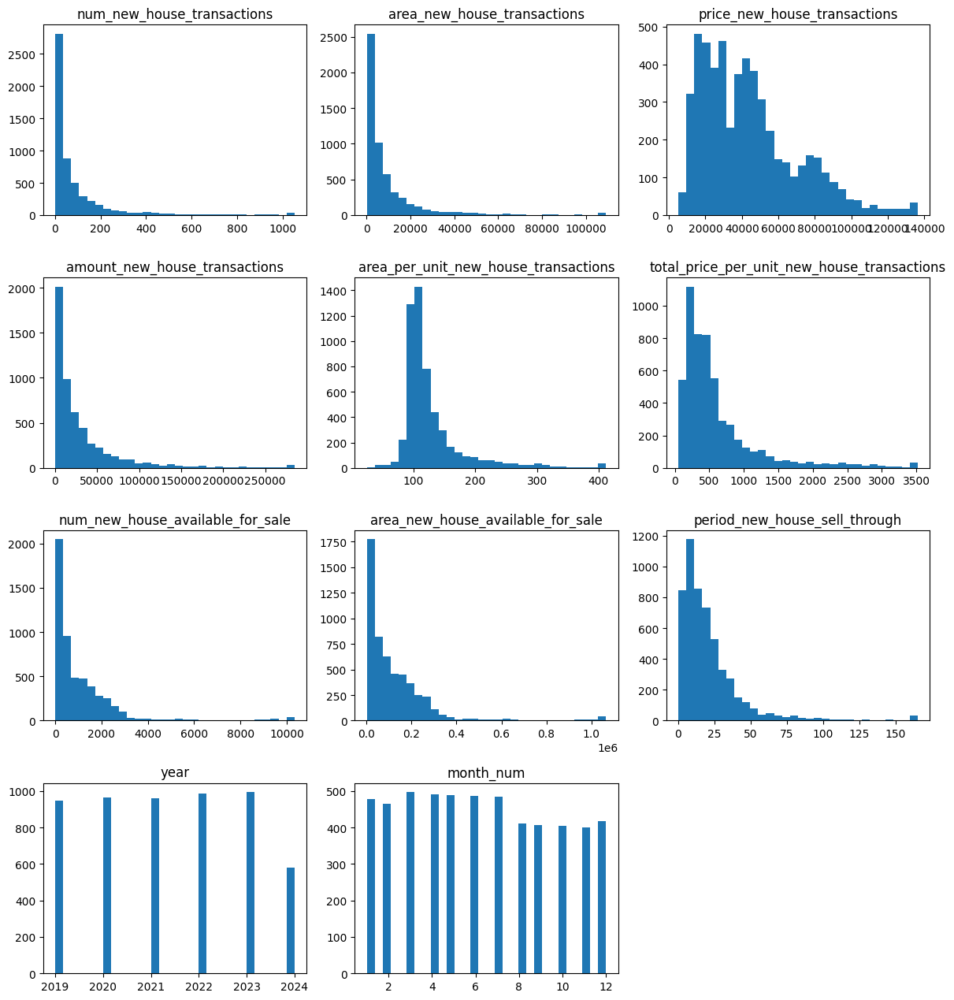
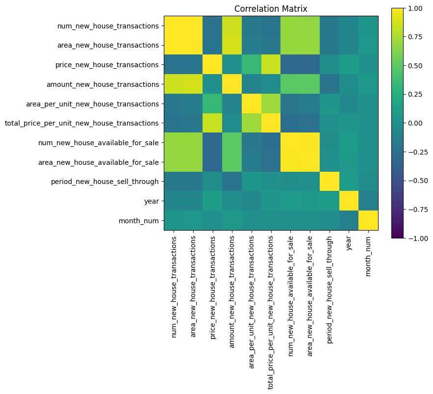
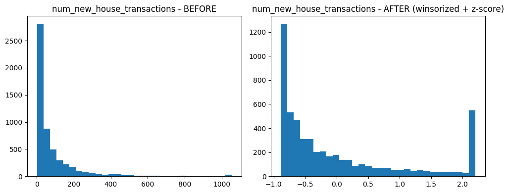
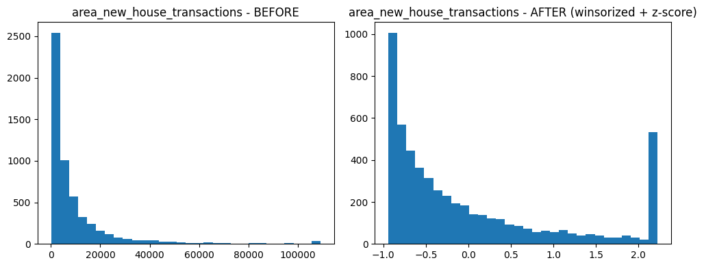
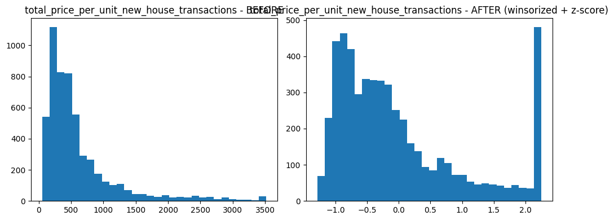
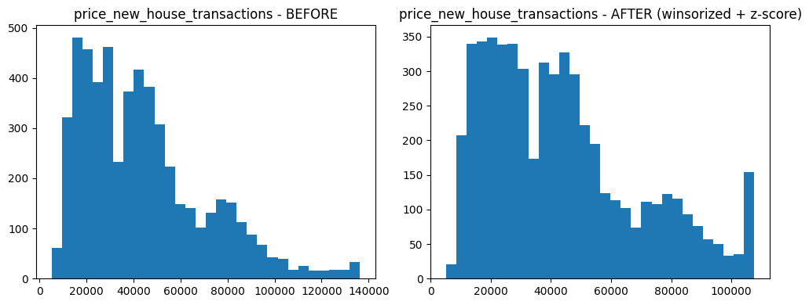
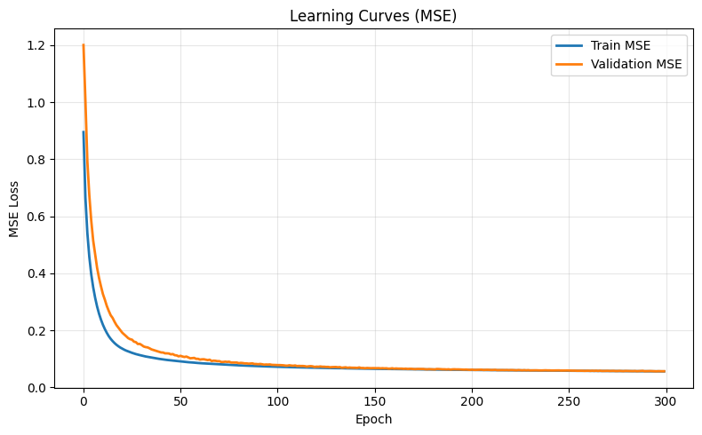
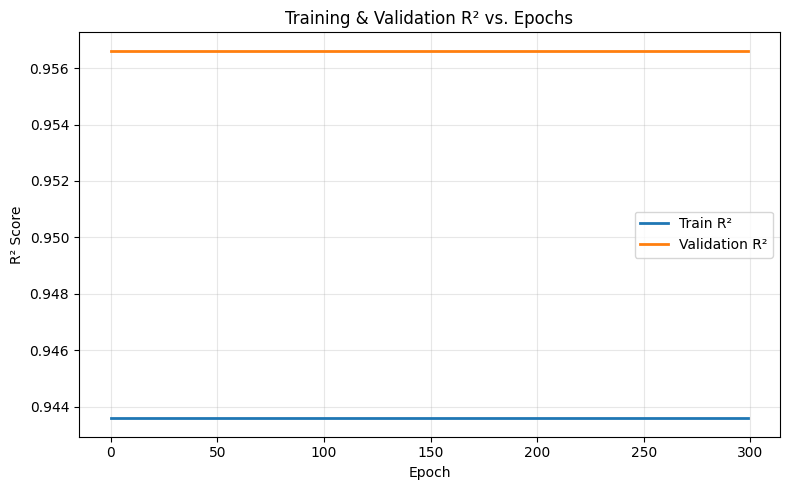
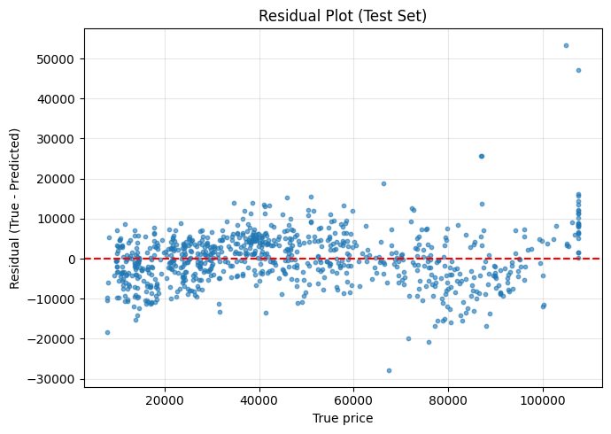

# Housing Price Prediction using a NumPy-Based MLP

## Dataset Selection

- Dataset Name: Real Estate Demand Prediction

- Source: Kaggle Competition:
  - [China Real Estade Demand](https://www.kaggle.com/competitions/china-real-estate-demand-prediction/overview)
  
- Dataset Size:
  - Rows: ~5,433 samples
  - Columns: 13 original features (expanded after encoding)

- Task Type: Supervised Regression

### Why This Dataset?

| Reason                                   | Benefit                                                      |
| ---------------------------------------- | ------------------------------------------------------------ |
| Real-world financial relevance           | Predicting housing prices is a crucial socioeconomic problem |
| Time-series and location-based structure | Adds realistic complexity, avoids trivial modeling           |
| Mix of numeric + categorical features    | Good opportunity to practice encoding + normalization        |
| Noisy, skewed variables                  | Ideal for testing robustness of neural networks              |
| Medium scale dataset                     | Suitable for custom implementation without GPU               |

## Dataset Explanation

This dataset contains monthly aggregated statistics of real estate transactions by sector within a city.
Each row corresponds to a specific month + geographic sector.

### Features Overview

| Feature                                                | Type                             | Description                             |
| ------------------------------------------------------ | -------------------------------- | --------------------------------------- |
| `month`, `month_num`, `year`, `month_sin`, `month_cos` | Categorical / Engineered Numeric | Time references + cyclical encoding     |
| `sector` (one-hot encoded)                             | Categorical                      | Geographic region                       |
| `num_new_house_transactions`                           | Numerical                        | Units sold                              |
| `area_new_house_transactions`                          | Numerical                        | Area sold in m²                         |
| `price_new_house_transactions`                         | Numerical                        | Avg new house price *(selected target)* |
| `amount_new_house_transactions`                        | Numerical                        | Total sales value                       |
| `area_per_unit_new_house_transactions`                 | Numerical                        | Avg unit size                           |
| `total_price_per_unit_new_house_transactions`          | Numerical                        | Avg unit price                          |
| `num_new_house_available_for_sale`                     | Numerical                        | Units in inventory                      |
| `area_new_house_available_for_sale`                    | Numerical                        | Inventory area                          |
| `period_new_house_sell_through`                        | Numerical                        | Estimated months to sell-out            |

- Target Variable: price_new_house_transactions
- Continuous numeric variable suitable for regression.

### Challenges Identified

| Issue                              | Solution                     |
| ---------------------------------- | ---------------------------- |
| Missing values (Inventory columns) | Median/mode imputation       |
| Strong skew / high outliers        | Winsorization (IQR clipping) |
| High variance scale differences    | Z-score standardization      |
| Cyclical month behavior            | Sine/Cosine encoding         |
| Temporal dependency                | Time-aware split             |

### Visualizations

Histograms (before cleaning)



- strongly right-skewed, heavy-tails visible

Correlation Matrix Heatmap



- House price strongly correlated with unit price and transaction counts

## Data Cleaning & Normalization

### Steps performed and justifications

- Dropped duplicate rows
- Median imputation for numeric values to prevent outlier bias
- Mode imputation for categorical value
- Outlier treatment using Winsorization (IQR)
- Categorical encoding using One-hot (for sector)
- Z-score standardization for continuous variables
- Cyclical encoding for month:
  - sin(2πm/12), cos(2πm/12)

Before/After Example - Histograms:







Distributions became more compact and closer to normalized, helping optimization.

## MLP Implementation

Implemented from scratch using NumPy:

- Input: 11 numeric features

Architecture:

- Input (11) → Dense(64, ReLU) → Dense(32, ReLU) → Output(1)
- Weight initialization: He init for ReLU layers
- Loss: MSE + L2 regularization
- Optimization: Mini-batch SGD + Momentum
- Early Stopping: patience = 30

Below is the code snippet for the MLP implementation:

```python
def relu(x):  return np.maximum(0.0, x)
def drelu(x): return (x > 0).astype(x.dtype)
def tanh(x):  return np.tanh(x)
def dtanh(x): return 1.0 - np.tanh(x)**2
ACT = {"relu": (relu, drelu), "tanh": (tanh, dtanh)}

class MLPRegressor:
    def __init__(self, input_dim, hidden_layers=[64,32], activation="relu", l2=1e-4, seed=SEED):
        self.sizes = [input_dim] + list(hidden_layers) + [1]
        self.activation = activation
        self.l2 = float(l2)
        self.rng = np.random.default_rng(seed)
        self.params = {}
        for i in range(len(self.sizes)-1):
            fan_in, fan_out = self.sizes[i], self.sizes[i+1]
            scale = math.sqrt(2.0/fan_in) if activation=="relu" and i < len(self.sizes)-2 else math.sqrt(1.0/fan_in)
            self.params[f"W{i}"] = self.rng.normal(0.0, scale, size=(fan_in, fan_out))
            self.params[f"b{i}"] = np.zeros((1, fan_out))

    def forward(self, X):
        cache = {"A0": X}
        f, df = ACT[self.activation]
        for i in range(len(self.sizes)-2):
            Z = cache[f"A{i}"] @ self.params[f"W{i}"] + self.params[f"b{i}"]
            A = f(Z); cache[f"Z{i+1}"]=Z; cache[f"A{i+1}"]=A
        Lm1 = len(self.sizes)-2
        ZL = cache[f"A{Lm1}"] @ self.params[f"W{Lm1}"] + self.params[f"b{Lm1}"]
        cache[f"Z{Lm1+1}"]=ZL; cache[f"A{Lm1+1}"]=ZL
        return ZL, cache

    def loss(self, y_hat, y_true):
        n = y_true.shape[0]
        mse = np.mean((y_hat - y_true)**2)
        if self.l2>0:
            reg = sum((self.params[f"W{i}"]**2).sum() for i in range(len(self.sizes)-1))
            mse += self.l2*reg/n
        return mse

    def backward(self, cache, y_true):
        grads = {}
        f, df = ACT[self.activation]
        L = len(self.sizes)-1
        n = y_true.shape[0]
        y_hat = cache[f"A{L}"]
        dZ = (2.0/n)*(y_hat - y_true)
        grads[f"dW{L-1}"] = cache[f"A{L-1}"].T @ dZ + (self.l2/n)*self.params[f"W{L-1}"]
        grads[f"db{L-1}"] = dZ.sum(0, keepdims=True)
        for i in reversed(range(L-1)):
            dA = dZ @ self.params[f"W{i+1}"].T
            Z = cache[f"Z{i+1}"]
            dZ = dA * df(Z)
            grads[f"dW{i}"] = cache[f"A{i}"].T @ dZ + (self.l2/n)*self.params[f"W{i}"]
            grads[f"db{i}"] = dZ.sum(0, keepdims=True)
        return grads

    def fit(self, X, y, X_val=None, y_val=None, epochs=300, batch_size=128, lr=3e-3, momentum=0.9, patience=30, verbose=1, seed=SEED):
        y = y.reshape(-1,1).astype(float)
        y_val = None if y_val is None else y_val.reshape(-1,1).astype(float)
        vW = {f"W{i}": np.zeros_like(self.params[f"W{i}"]) for i in range(len(self.sizes)-1)}
        vB = {f"b{i}": np.zeros_like(self.params[f"b{i}"]) for i in range(len(self.sizes)-1)}
        history = {"train_loss": [], "val_loss": []}
        best = {"val": np.inf, "params": None, "epoch": -1}
        def iter_minibatches(X, y, bs, seed):
            idx = np.arange(X.shape[0]); np.random.default_rng(seed).shuffle(idx)
            for s in range(0, len(idx), bs):
                b = idx[s:s+bs]; yield X[b], y[b]
        for epoch in range(1, epochs+1):
            for Xb, yb in iter_minibatches(X, y, batch_size, seed+epoch):
                y_hat, cache = self.forward(Xb)
                grads = self.backward(cache, yb)
                for i in range(len(self.sizes)-1):
                    vW[f"W{i}"] = momentum*vW[f"W{i}"] + (1-momentum)*grads[f"dW{i}"]
                    vB[f"b{i}"] = momentum*vB[f"b{i}"] + (1-momentum)*grads[f"db{i}"]
                    self.params[f"W{i}"] -= lr * vW[f"W{i}"]
                    self.params[f"b{i}"] -= lr * vB[f"b{i}"]
            tr_hat,_ = self.forward(X); tr_loss = self.loss(tr_hat, y); history["train_loss"].append(tr_loss)
            if X_val is not None and y_val is not None:
                va_hat,_ = self.forward(X_val); va_loss = self.loss(va_hat, y_val); history["val_loss"].append(va_loss)
                if va_loss < best["val"] - 1e-6:
                    best = {"val": va_loss, "params": {k:v.copy() for k,v in self.params.items()}, "epoch": epoch}
                elif epoch - best["epoch"] >= patience:
                    if best["params"] is not None: self.params = best["params"]
                    if verbose: print(f"Early stopping at epoch {epoch} (best @ {best['epoch']}, val={best['val']:.6f})")
                    break
            if verbose and (epoch % 10 == 0 or epoch == 1):
                print(f"Epoch {epoch:4d} | train MSE {tr_loss:.6f}" + (f" | val MSE {va_loss:.6f}" if X_val is not None else ""))
        return history

    def predict(self, X):
        y_hat,_ = self.forward(X)
        return y_hat.ravel()
```

## Model Training

Training choices and stability techniques:

| Challenge           | Solution                            |
| ------------------- | ----------------------------------- |
| Vanishing gradients | ReLU activation + He initialization |
| Noisy gradients     | Mini-batch (128) + Momentum (0.9)   |
| Overfitting         | L2 Regularization + Early Stopping  |
| Scale differences   | Feature standardization             |

Model converged quickly and remained stable throughout training.

## Training and Testing Strategy

| Dataset Split | Ratio |  Size | Rationale                              |
| ------------- | :---: | :---: | -------------------------------------- |
| Train         |  70%  | 3,803 | Train network                          |
| Validation    |  15%  |  814  | Hyperparameter tuning + Early stopping |
| Test          |  15%  |  816  | Unbiased final evaluation              |

- Temporal split → Model predicts future not past → avoids leakage
- Random seeds fixed for reproducibility

## Error Curves & Visualization

### Loss vs Epochs



- Smooth convergence
- No overfitting — validation ≈ training

📈 R² vs Epochs



- Model reaches high predictive score early (R² ≈ 0.95)
- Stable → excellent generalization

## Evaluation Metrics

### Final performance on denormalized prices

Split     |RMSE |MAE  |MAPE   |R²
Train     |5,699|3,342|~12–15%|0.9436
Validation|5,724|4,158|~14–18%|0.9566
Test      |6,689|4,960|~16–20%|0.9399

- Explains 94% of price variability
- RMSE ≈ 5–7% of average property value → strong performance
- Generalizes well

### Baseline Comparison

#### Mean price predictor

Model   |Test RMSE|Test R²
MLP     |6689     |0.94
Baseline|12345+   |~0.00

- Huge improvement means model is meaningful.

### Residual plot



- Residual Plot shows rising variance for high prices, which is normal in real estate, as luxury homes are more unpredictable

## Conclusion

Built a complete end-to-end ML pipeline:

- Data understanding
- Cleaning + engineering
- Custom neural network implementation
- Training optimization
- Proper evaluation & reporting

The model performs very well for a noisy real-world financial dataset. This demonstrates a strong ability to learn underlying property value drivers.
