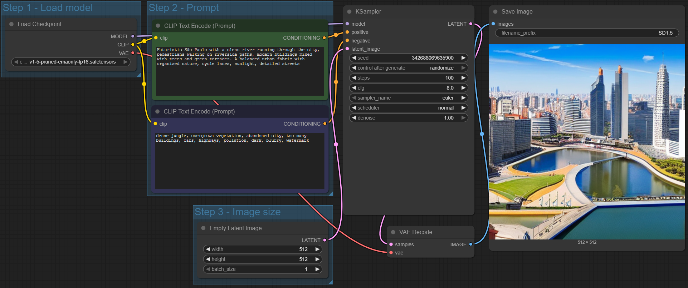
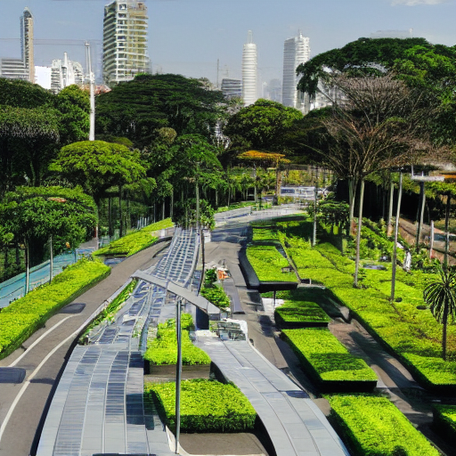
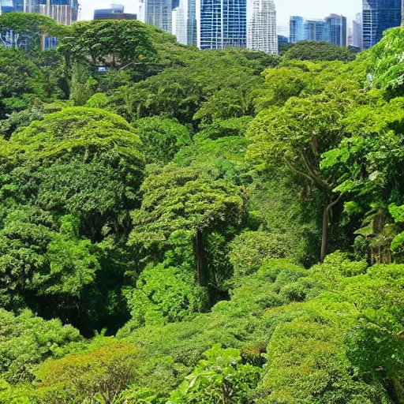
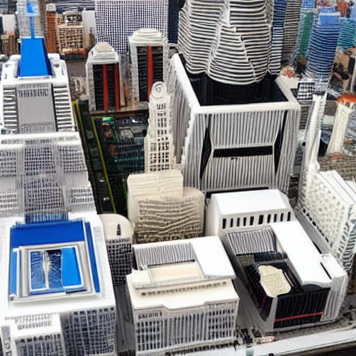
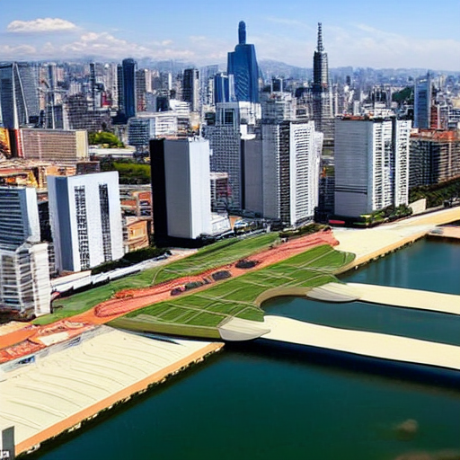
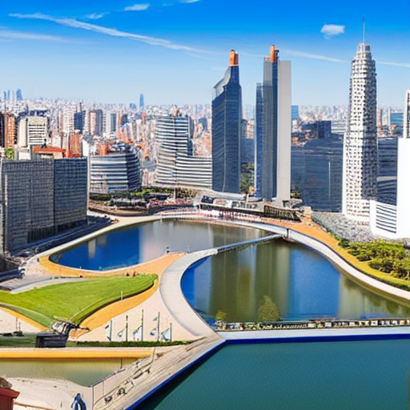
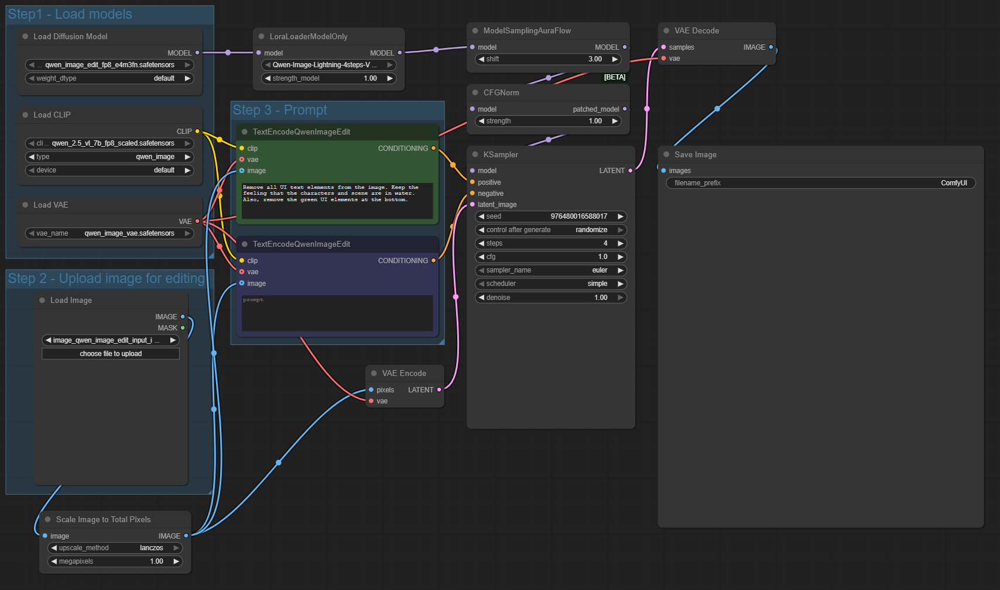
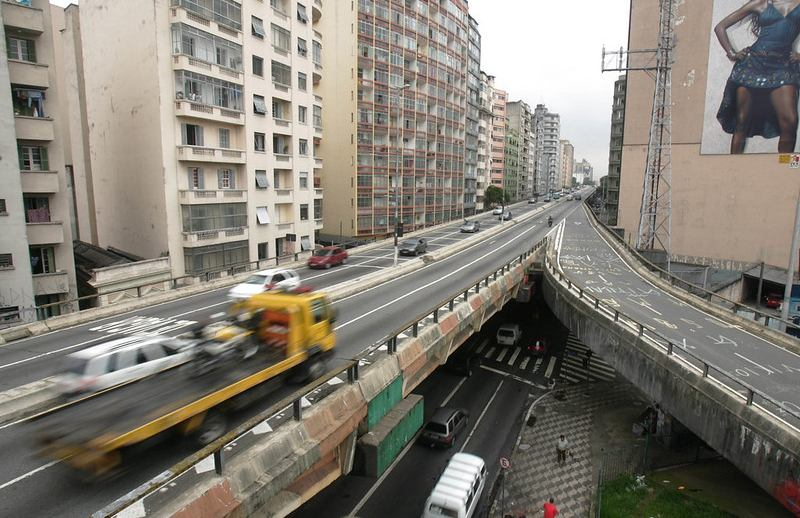
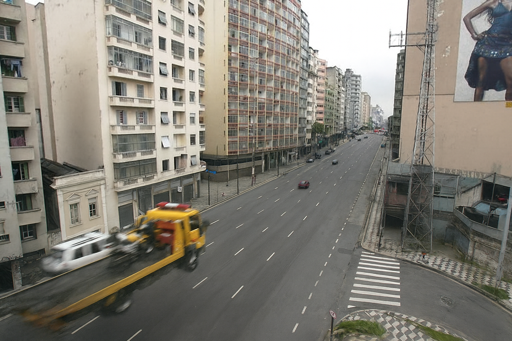
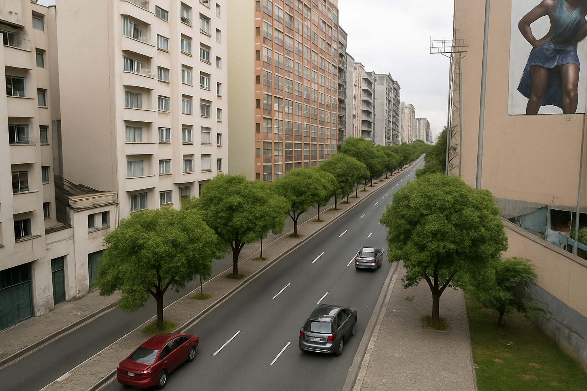

# Projeto 3 - Generative AI

## Introduction

This project has the goal of exploring generative models, focusing on **image generation** and **image editing** using **Stable Diffusion**, a text-to-image deep learning model fo generative AI. As part of the assignment, this document will walk you through all the steps for building and generating or editing images through a generative AI pipeline.

To achieve this, the first step is to [install ComfyUI](https://www.comfy.org/download), an open-source, node-based platform (much like Unreal Engine for game development) designed for building generative workflows. ComfyUI's interface ensures an easy to build experience for the user and it's environment simplifies the steps for prototyping complex pipelines in various generative AI functions, such as: text-to-image, image-to-image, text-to-audio, image-to-video, upscaling, and other operations. ComfyUI also has a very strong online community, which allows users to import pre-built **templates**,  **workflows**, **AI models**, and other tools for the generative pipeline.

## Project Scope

When it comes to contemporary debates over public policies for the development of cities, matters such as **quality of life, ease of transportation, and sustainability** are crucial for setting up cities to be better adapted for current and future problems that society may come across. As such, public agencies responsible for ensuring the cities' well-being have become increasingly tasked with providing complex solutions for the problems faced, but also tasked with being able to communicate clearly what these projects will look like for the population.

With this project, the use of ComfyUI will be employed with the tasks of **image generation** and **image editing**, with the intent purpose of rendering images showing what current cities will look like in the future once these projects get implemented. Employing the tech used in this project, it is expected that the process of visual communication will become a much simpler task for both the governing bodies tasked with developing said projects and the population that will recieve these projects.

## 1 - Image Generation

### Pipeline

For the image generation portion of this project, the following steps are employed in the pipeline:

- CheckpointLoaderSimple — loads MODEL + CLIP + VAE from SD1.5.
- CLIPTextEncode (Positive) — prompt input for what you want in the model.
- CLIPTextEncode (Negative) — prompt input for what you want the model to avoid.
- KSampler — generates the latent image through iterative denoising.
- VAEDecode — turns the latent tensor into a real image.
- SaveImage — saves the image to output folder.

The image for the workflow is as follows:

Now, let us detail what each step of the process does.

#### CheckpointLoaderSimple

As the beggining step of the process, it loads the entire AI model (Stable Diffusion v1.5 in this case), which has three key components:

- MODEL: The diffusion model itself, in this case Stable Diffusion, which adds noise to images and recreates them by "denoising" the image through various iterations. Check the simplified diagram below:
  
  - Noise → MODEL → Less noise → MODEL → … → Final latent image

- CLIP: The text encoder, which converts the input text prompts (positive and negative) into a numeric representation the diffusion model can use.
- VAE: The encoder/decoder for latent space image generation:
  
  - The encoder compresses images into latent form
  - The decoder turns the latent result into a real image

The first checkpoint loads the file:

- v1-5-pruned-emaonly-fp16.safetensors

Which in turn follows the pipelines input/output relation as such:

- CLIP -> CLIPTextEncoders
- Model -> KSampler
- VAE -> VAE Decode

#### ClipTextEncode Positive

Recieves the prompt for what the user **wants** to see generated in the outputted image.

Follows the pipeline by feeding into the KSamplers' positive portion:

- ClipTextEncode Positive -> KSampler positive parameter

#### ClipTextEncode Negative

Recieves the prompt for what the user **does not want** to see generated in the outputted image.

Follows the pipeline by feeding into the KSamplers' negative portion:

- ClipTextEncode negative -> KSampler negative parameter

#### Latent Image Setup

Creates a blank latent tensor sized:

- 512 × 512 (value of image size that Stable Diffusion v1.5 is trained on, produces better results)
- batch size 1, meaning only 1 image will be generated

This is the blank canvas the diffusion model will paint on.

Following that, the output will feed into the pipeline as such:

- LatentImageSetup -> KSamplers latent_image portion

#### KSampler

The core of Stable Diffusion. It recieves the following inputs:

- MODEL
- Positive conditioning
- Negative conditioning
- Latent image
- Sampling parameters (seed, steps, sampler type, CFG scale)

As the other inputs have been explained recently, let us explain the **sampling parameters**:

- Seed: Random number used to randomize the outputs. By using the same seed and parameters as another user, the output will be exactly the same.
- Control after generate: Determines what the KSampler does after finishing the process, such as refining, looping, or passing control to another node
- Steps: Number of denoising iterations the diffusion model will have to perform when generating the image.
- CFG (Classifier-Free Guidance): A strength value that controls how strongly the model should follow your prompt. A lower number means a more "loose" and creative model, while a higher number ensures a more rigorous following of the prompt.
- Sampler name: Algorithm used to perform the diffusion steps such as Euler, DPM++, DDIM, etc.
- Scheduler: Controls how noise is reduced across the steps. It changes the curve (Normal, Karras) of the denoising process.
- Denoise: A multiplier (0–1) that controls how much denoising should happen. A value of 1 means a full generation, less than that can mean partial edits, image-to-image, or slight variations.

It also recieves the following functions:

- Iterative denoising in latent space: Starting with random noise and slowly cleans it over iterations inside a compressed latent space. Each iteration refines the features of the output image.
- Generation of a final latent representation of the output image: After the last step, the model produces a final latent tensor, which will then be decoded into RGB by the VAE decoder.

#### VAE Decode

As the penultimate step of the process, the **VAE Decode** portion of the pipeline does a simple, yet crucial, transformation for the image generation process. By recieving the outputs from KSampler in a latent state, and recieving the VAE model from the first step (Load Model), the VAE Decode step translates the image from latent space into an RGB-readable output. After that, it sends the output into the last step, Save Image.

- VAE Decode -> Save Image

#### Save Image

As the final step of the process, the Save Image portion takes the rendered image from VAE Decode and saves it into a folder of your choosing. For this project, the files are saved into ComfyUI/output/ with the prefix SD1.5 .

### Generated Images

For the first generated image, following the idea of creating a render of a cityscape with good urban practices, I sent as a positive prompt the following:

- "futuristic version of the city of São Paulo. Lush landscaping, nature integrated with technology. riverside with cycle lanes"

For the negative prompts, I kept the default options:

- "text, watermark"

The output is as such:

As you can see, the overall image looks lacking in detail and resolution quality, with particular regards to the streetscape.

For the second generated image, I used the help of ChatGPT to create prompts for the image generation, as a LLM would help me create prompts that are better suited for the understanding of the workflow. The following is the positive prompt used:

- "Futuristic São Paulo with lush green architecture, vertical forests, clean rivers flowing through the city, elevated cycle lanes and bike highways as the main transportation system. Modern eco-friendly skyscrapers covered in vegetation, pedestrian plazas, sustainable urban design, bright natural light, harmonious integration between nature and advanced technology. No cars, no expressways, a peaceful vibrant metropolis filled with greenery and water channels"

And the negative prompt:

- "cars, highways, expressways, traffic, roads full of vehicles, smoke, pollution, factories, industrial waste, garbage, crowds, haze, blur, distorted buildings, low resolution, text, watermark, logo, signature, artifacts, grainy, overexposed, dark shadows, low detail"

Below is the output:

As you can observe, the prompts including a heavy focus on nature and greenery made the output focus too much on the natural side of what was asked for and too little on the cityscape aspect. That will be changed in the next generation.

For the third image generated, I decided to dial back on the amount of greenery and focus more on the urban fabric. As such, the positive and negative prompts, respectively, were:

- "Futuristic São Paulo with dense urban architecture, modern skyscrapers, mixed-use buildings, pedestrian streets, integrated green rooftops and vertical gardens. Clean rivers with bike lanes along the edges, sustainable urban design, technology-integrated infrastructure. Nature is present but controlled and organized — planted trees, green facades, rooftop parks — not wild jungle. Bright daylight, clear visibility, detailed city layout"
- "overgrown forest, dense jungle, wild vegetation, thick canopy, vines covering everything, nature overtaking the city, abandoned city, ruins, excessive trees, too much greenery, cars, highways, expressways, pollution, haze, blur, low detail, text, watermark"

With that, we get the following output:

The image generated still seems a little blurry and lacking in detail. With that in mind, the new implementation handled a batch size of 2, meaning 2 images were generated, and with extra steps, bumping up from **40** to **100**. The prompts were also handled accordingly:

- "Futuristic São Paulo with a clean river running through the city, pedestrians walking on riverside paths, modern buildings mixed with trees and green terraces. A balanced urban fabric with organized nature, cycle lanes, sunlight, detailed streets"
- "dense jungle, overgrown vegetation, abandoned city, too many buildings, cars, highways, pollution, dark, blurry, watermark"

With that, we get the following outputs:

Much better. Whilst still lacking in detail and sharpness, the model adapted well to the changes recieved. For the next step, we shall explore image editing and try to implement solutions that work with real life images for added context.

## 2 - Image Editing

### Pipeline - Image Editing (ComfyUI + Qwen Image Edit)

For editing an existing image, the pipeline uses the following components:

- Load Diffusion Model + CLIP + VAE — loads the Qwen image editing models.
- LoRA Loader (Optional) — modifies the base model with additional capabilities.
- Upload Image — the user-supplied photo used as the base of the edit.
- Scale Image to Total Pixels — resizes image to model-optimal resolution.
- VAE Encode — converts the input photo into latent space for editing.
- TextEncodeQwenImageEdit (Positive) — describes what you want the edit to do.
- TextEncodeQwenImageEdit (Negative) — describes what you want the model to avoid.
- Sampling Stack (AuraFlow → CFGNorm → KSampler) — performs the actual edit through controlled denoising.
- VAE Decode — converts edited latent back into RGB.
- SaveImage — outputs the final edited image.

The image for the workflow is as follows:

Now, let us detail what each step of the process does.

#### Load Models

- Load Diffusion Model

Loads the Qwen Image Edit diffusion model:

- File: `qwen_image_edit_fp8_e4m3fn.safetensors`
- Provides the **MODEL** used during denoising/editing.
- This model is optimized specifically for **image editing**, not text-to-image generation.

- Load CLIP

Loads the Qwen CLIP text encoder:

- Converts text prompts into numerical embeddings.
- These embeddings guide the editing process.

- Load VAE

Loads the VAE used to:

- Encode real images → latent space  
- Decode edited latents → final RGB image  

These three components together replace the SD1.5 checkpoint node used in the full-generation workflow.

- LoRALoaderModelOnly (Optional)

- Loads a LoRA (Lightweight Low-Rank Adaptation).
- Enhances or modifies model behavior.
- In this workflow:  
  `Qwen-Image-Lightning-4steps` with strength **1.0**.

Output is a *patched model* used for sampling.

#### Upload Image for Editing

- Load Image

This node imports the user’s selected image.  
This image becomes the **base content** that the model will edit.

- Scale Image to Total Pixels

Because the editing model expects a total pixel value around 1 megapixel:

- The node rescales your input proportionally.
- Helps maintain model stability.
- Prevents GPU overload.

Output → VAE encoder

#### Prompt Encoding

This workflow uses **TextEncodeQwenImageEdit**, which takes the CLIP model, VAE model, and optionally the image itself to create prompt-aligned conditioning.

- Positive Prompt Encoder

This node encodes instructions specifying **what changes you want**.

Output → **positive conditioning** to KSampler.

- Negative Prompt Encoder

Encodes what the model should avoid producing.

Even a blank prompt is valid, though optional.

Output → **negative conditioning** to KSampler.

#### VAE Encode

The scaled input image is passed to **VAE Encode**, which:

- Compresses the image into latent format.
- Produces the starting point for editing.

Unlike full image generation (which starts from noise), editing starts from **the latent version of the real image**.

Output → **latent_image** input to the KSampler.

#### Sampling Stack (AuraFlow → CFGNorm → KSampler)

These components execute the actual image editing operation.

- ModelSamplingAuraFlow

  - Applies structural shift (`shift = 3.0`) to influence editing strength.
  - Helps the model perform transformations smoothly.

- CFGNorn

  - Applies classifier-free guidance normalization.
  - Ensures balanced prompt adherence.

- KSampler

The central denoising/editing engine.

Receives:

- Patched MODEL  
- Positive conditioning  
- Negative conditioning  
- Encoded latent image  
- Sampling parameters  

- Key Parameters

  - Seed — random or fixed reproducibility  
  - Steps = 4 — optimized for Qwen Lightning  
  - CFG = 1.0 — low prompt strength, natural edits  
  - Sampler = Euler  
  - Scheduler = simple  
  - Denoise = 1.0  
    - `denoise = 1.0` → strong full edit  
    - `denoise < 1.0` → gentle or partial edits  

Output → edited latent image.

#### VAE Decode - Editing

- Converts the edited latent back into a standard RGB image.
- Uses the loaded Qwen VAE.

Output → passed to SaveImage.

#### Save Image - Editing

Final step:

- Saves the output image to `ComfyUI/output/`
- Uses the configured file name prefix.

### Generated Images - Image Editing

By playing with the model previously, it was chosen to edit the image step-by-step instead of making a large change from the get-go. As such, we started with an image of an elevated highway in São Paulo subject to controversy in terms of urbanistic qualities. The goal is to remove the elevated highway from the photo and add elements of good urbanism to the output. The input image is the following:

The first iteration will employ removing the elevated highway from the photo. As such, these are the following configurations:

- "remove the elevated highway"
- "blurry, watermark, pollution, noise"
- steps: 40

The output is as follows:

Considering the model is much heavier and polished, the output is excellent. The following iteration uses this output as the input, with these parameters for configuration:

- "remove the truck. Add trees to the street"
- "blurry, watermark, pollution, noise"
- steps: 40

This produced the following output:

With that, it has been proven that image editing is the best way of creating image renders for urbanistic solutions.

## Conclusion

This project demonstrated how generative AI tools, such as Stable Diffusion and Qwen Image Edit, can effectively support urban planning by producing representations of future cityscape renderings. By tinkering with prompts, parameters, and workflows, the tools were able to generate cityscapes and transform current urban photos.

The results show that while text-to-image generation is useful for exploration, the more powerful workflow from the image editing portion provides better results for communicating urbanistic developments.

## Resources used in this project

- [ComfyUI Manager Install](https://github.com/Comfy-Org/ComfyUI-Manager)

- [First Generation on ComfyUI](https://docs.comfy.org/get_started/first_generation)

- [ChatGPT](chat.openai.com)
