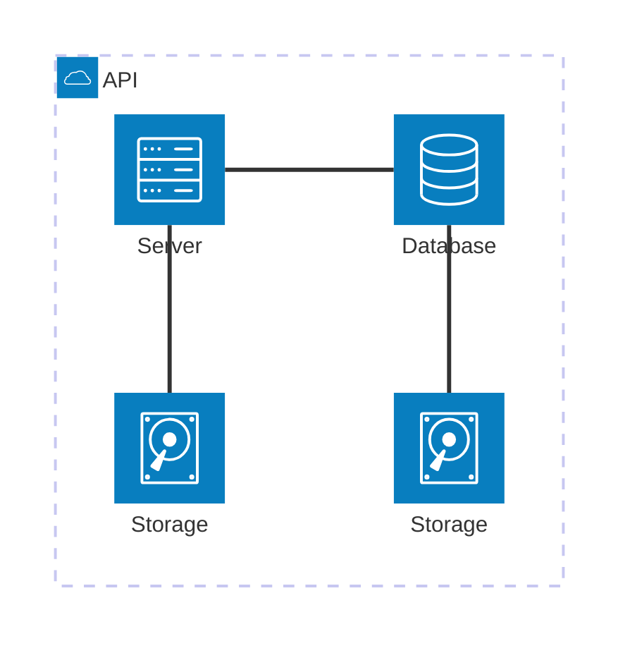

# Roteiro 1 - Data Preparation and Analysis for Neural Networks

This activity is designed to test your skills in generating synthetic datasets, handling real-world data challenges, and preparing data to be fed into neural networks.

## Excercise 1 - Exploring Class Separability in 2D

generate and visualize a two-dimensional dataset to explore how data distribution affects the complexity of the decision boundaries a neural network would need to learn.

### Generate the Data

Start by importing necessary libraries for this project:

<!-- termynal -->

``` bash
pip install matplotlib pandas scikit-learn numpy
```

Create a synthetic dataset with a total of 400 samples, divided equally among 4 classes (100 samples each). Use a Gaussian distribution to generate the points for each class based on the following parameters:

- Class 0: Mean = [2,3] , Standard Deviation = [0.8,2.5]
- Class 1: Mean = [5,6], Standard Deviation = [1.2,1.9]
- Class 2: Mean = [8,1], Standard Deviation = [0.9,0.9]
- Class 3: Mean = [15,4], Standard Deviation = [0.5,2.0]

``` pyodide install="pandas,matplotlib,scikit-learn,numpy"
import numpy as np
import pandas as pd
import matplotlib.pyplot as plt

rng = np.random.default_rng(42)

params = {
    0: {"mean": np.array([2.0, 3.0]), "std": np.array([0.8, 2.5])},
    1: {"mean": np.array([5.0, 6.0]), "std": np.array([1.2, 1.9])},
    2: {"mean": np.array([8.0, 1.0] ), "std": np.array([0.9, 0.9])},
    3: {"mean": np.array([15.0, 4.0]), "std": np.array([0.5, 2.0])},
}

n_samples_class = 100

data_list = []
for cls, p in params.items():
    samples = rng.normal(loc=p["mean"], scale=p["std"], size=(n_samples_class, 2))
    labels = np.full((n_samples_class, 1), cls, dtype=int)
    data_list.append(np.hstack([samples, labels]))

# Combine
data = np.vstack(data_list)
df = pd.DataFrame(data, columns=["x1", "x2", "label"]).astype({"label": int})

# Shuffle rows
df = df.sample(frac=1.0, random_state=123).reset_index(drop=True)

# Save to CSV
csv_path = "synthetic_gaussian_4class_400.csv"
df.to_csv(csv_path, index=False)

# Show class counts
counts = df["label"].value_counts().sort_index()

# Display a preview to the user
df.head(500)

```


/// caption
Dashboard do MAAS
///

Conforme ilustrado acima, a tela inicial do MAAS apresenta um dashboard com informações sobre o estado atual dos servidores gerenciados. O dashboard é composto por diversos painéis, cada um exibindo informações sobre um aspecto específico do ambiente gerenciado. Os painéis podem ser configurados e personalizados de acordo com as necessidades do usuário.

### Tarefa 2

## App


### Tarefa 1

### Tarefa 2

Exemplo de diagrama



[Mermaid](https://mermaid.js.org/syntax/architecture.html){:target="_blank"}

## Questionário, Projeto ou Plano

Esse seção deve ser preenchida apenas se houver demanda do roteiro.

## Discussões

Quais as dificuldades encontradas? O que foi mais fácil? O que foi mais difícil?

## Conclusão

O que foi possível concluir com a realização do roteiro?
