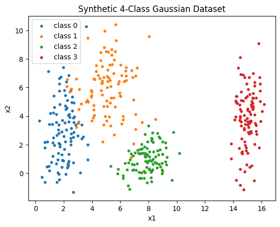
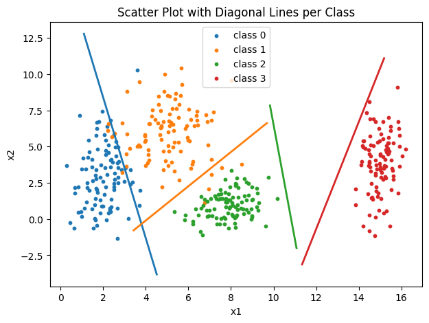
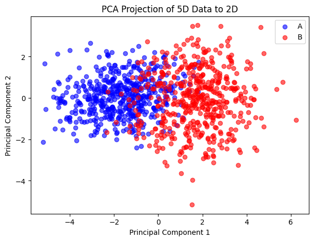
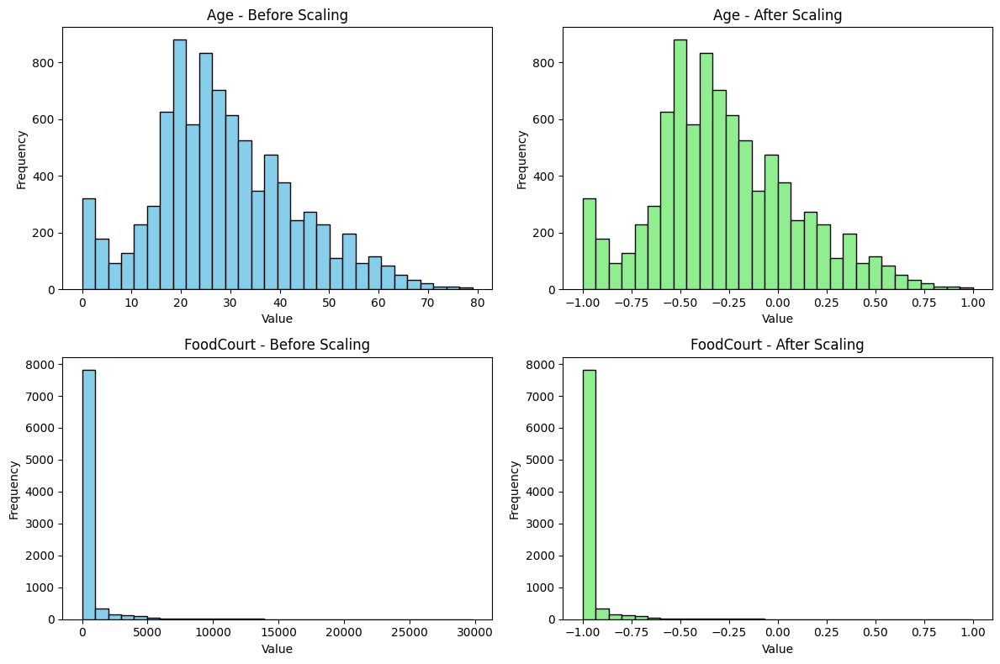

# 1 - Data Preparation and Analysis for Neural Networks

This activity is designed to test your skills in generating synthetic datasets, handling real-world data challenges, and preparing data to be fed into neural networks.

## Excercise 1 - Exploring Class Separability in 2D

generate and visualize a two-dimensional dataset to explore how data distribution affects the complexity of the decision boundaries a neural network would need to learn.

### Generate the Data

Start by importing necessary libraries for this project:

<!-- termynal -->

``` bash
pip install matplotlib pandas scikit-learn numpy
```

Create a synthetic dataset with a total of 400 samples, divided equally among 4 classes (100 samples each). Use a Gaussian distribution to generate the points for each class based on the following parameters:

- Class 0: Mean = [2,3] , Standard Deviation = [0.8,2.5]
- Class 1: Mean = [5,6], Standard Deviation = [1.2,1.9]
- Class 2: Mean = [8,1], Standard Deviation = [0.9,0.9]
- Class 3: Mean = [15,4], Standard Deviation = [0.5,2.0]

To do this, we run the code below, which creates the points and the distribution using a random state:

```python
import numpy as np
import pandas as pd
import matplotlib.pyplot as plt

rng = np.random.default_rng(42)

params = {
    0: {"mean": np.array([2.0, 3.0]), "std": np.array([0.8, 2.5])},
    1: {"mean": np.array([5.0, 6.0]), "std": np.array([1.2, 1.9])},
    2: {"mean": np.array([8.0, 1.0] ), "std": np.array([0.9, 0.9])},
    3: {"mean": np.array([15.0, 4.0]), "std": np.array([0.5, 2.0])},
}

n_samples_class = 100

data_list = []
for cls, p in params.items():
    samples = rng.normal(loc=p["mean"], scale=p["std"], size=(n_samples_class, 2))
    labels = np.full((n_samples_class, 1), cls, dtype=int)
    data_list.append(np.hstack([samples, labels]))

# Combine
data = np.vstack(data_list)
df = pd.DataFrame(data, columns=["x1", "x2", "label"]).astype({"label": int})

# Randomize rows -> use seed for random state
df = df.sample(frac=1.0, random_state=123).reset_index(drop=True)
csv_path = "synthetic_gaussian_4class_400.csv"
df.to_csv(csv_path, index=False)

counts = df["label"].value_counts().sort_index()
df.head(500)

```

### Plot the data

By plotting the data created with the above code, we get the following output:


/// caption
Scatter plot of points
///

The following can be seen in the plot:

#### Class 0 (mean [2,3], elongated vertically, slight spread horizontally)

- Class 0 is spread more in the vertical direction. It also has a slight spread horizontally.
  - The minimum and maximum values of the points in Class 0 are:
  - min_x: 0.294363
  - max_x: 3.713318
  - min_y: -1.318301
  - max_y: 10.284656
- As such, it's points form a tall, narrow cluster near the lower-left corner.

#### Class 1 (mean [5,6], larger spread horizontally and vertically)

- Centered above Class 0 and class 2, to the left of Class 0 and to the right of Class 2, it has the largest horizontal spread.
- The minimum and maximum values of the points in Class 1 are:
  - min_x: 2.227876
  - max_x: 8.486081
  - min_y: 1.123349
  - max_y: 10.422541
- Its cluster overlaps somewhat in vertical extent with Class 0.
- Does not appear to have a distinguished shape

#### Class 2 (mean [8,1], compact "round" cluster)

- This class is tighter (std = [0.9, 0.9]) and appears in the bottom-middle region.
- Class 2 doesn’t overlap much with Classes 0 or 1 because it’s horizontally farther away and has limited vertical amplitude.
- The minimum and maximum values of the points in Class 1 are:
  - min_x: 5.331924
  - max_x: 10.178374
  - min_y: -1.100255
  - max_y: 3.337906
- Limited amplitudes horizontally and vertically create "rounded" appearance of cluster

#### Class 3 (mean [15,4], elongated horizontally)

- Very far to the right, centered at x ≈ 15, with std = [0.5, 2.0].
- Does not overlap with any of the other classes.
- As such, it forms a tall, narrow vertical band, to the far right of the plot.
- The minimum and maximum values of the points in Class 1 are:
  - min_x: 13.839822
  - max_x: 16.191301
  - min_y: -1.129489
  - max_y: 9.098656

Because some overlap is seen between classes, a linear boundary will not separate each class perfectly, producing a few outliers in the process. With that being said, each Class significantly occupies a unique region in the graph. As such, disregarding outliers, a designating a linear boundary is possible

### Analyze and Draw Boundaries

With that, we can plot the scatter plot with boundaries. The code to do so is as such:

```python

min_x_0 = bounds.loc[bounds["label"] == 0, "min_x"].values[0] + params[0]["std"][0]
min_x_1 = bounds.loc[bounds["label"] == 1, "min_x"].values[0] + params[1]["std"][0]
min_x_2 = bounds.loc[bounds["label"] == 2, "min_x"].values[0] + 5*params[2]["std"][0] # std has lower impact, increase size of relevance
min_x_3 = bounds.loc[bounds["label"] == 3, "min_x"].values[0] - 5*params[3]["std"][0] # std has lower impact, increase size of relevance


max_x_0 = bounds.loc[bounds["label"] == 0, "max_x"].values[0] + params[0]["std"][0]
max_x_1 = bounds.loc[bounds["label"] == 1, "max_x"].values[0] + params[1]["std"][0]
max_x_2 = bounds.loc[bounds["label"] == 2, "max_x"].values[0] + params[2]["std"][0]
max_x_3 = bounds.loc[bounds["label"] == 3, "max_x"].values[0] - 2*params[3]["std"][0] # std has lower impact, increase size of relevance


min_y_0 = bounds.loc[bounds["label"] == 0, "min_y"].values[0] - params[0]["std"][1]
min_y_1 = bounds.loc[bounds["label"] == 1, "min_y"].values[0] - params[1]["std"][1]
min_y_2 = bounds.loc[bounds["label"] == 2, "min_y"].values[0] - params[2]["std"][1]
min_y_3 = bounds.loc[bounds["label"] == 3, "min_y"].values[0] - params[3]["std"][1]


max_y_0 = bounds.loc[bounds["label"] == 0, "max_y"].values[0] + params[0]["std"][1]
max_y_1 = bounds.loc[bounds["label"] == 1, "max_y"].values[0] - 2*params[1]["std"][1] # std has lower impact, increase size of relevance
max_y_2 = bounds.loc[bounds["label"] == 2, "max_y"].values[0] + 5*params[2]["std"][1] # std has lower impact, increase size of relevance
max_y_3 = bounds.loc[bounds["label"] == 3, "max_y"].values[0] + params[3]["std"][1]

stds = df.groupby("label").agg(std_x=("x1","std"), std_y=("x2","std")).reset_index()

bounds_std = bounds.merge(stds, on="label")

plt.figure(figsize=(7,5))
for cls in sorted(df["label"].unique()):
    subset = df[df["label"] == cls]
    plt.scatter(subset["x1"], subset["x2"], label=f"class {cls}", s=10)

plt.plot([min_x_0, max_x_0], [max_y_0, min_y_0], linewidth=2)
plt.plot([min_x_1, max_x_1], [min_y_1, max_y_1], linewidth=2)
plt.plot([min_x_2, max_x_2], [max_y_2, min_y_2], linewidth=2)
plt.plot([min_x_3, max_x_3], [min_y_3, max_y_3], linewidth=2)

plt.title("Scatter Plot with Diagonal Lines per Class")
plt.xlabel("x1")
plt.ylabel("x2")
plt.legend()
plt.show()
```

With that, the expected output is as such:


/// caption
Scatter plot of points with boundaries
///

## Excercise 2 - Non-Linearity in Higher Dimensions

Deep networks excel when data is not linearly separable. This exercise challenges you to create and visualize such a dataset.

### Generate the data

```python

# Parameters
mean_A = np.array([0, 0, 0, 0, 0], dtype=float)
cov_A = np.array([
    [1,   0.8, 0.1, 0.0, 0.0],
    [0.8, 1.0, 0.3, 0.0, 0.0],
    [0.1, 0.3, 1.0, 0.5, 0.0],
    [0.0, 0.0, 0.5, 1.0, 0.2],
    [0.0, 0.0, 0.0, 0.2, 1.0],
], dtype=float)

mean_B = np.array([1.5, 1.5, 1.5, 1.5, 1.5], dtype=float)
cov_B = np.array([
    [1.5, -0.7, 0.2, 0.0, 0.0],
    [-0.7, 1.5, 0.4, 0.0, 0.0],
    [0.2, 0.4, 1.5, 0.6, 0.0],
    [0.0, 0.0, 0.6, 1.5, 0.3],
    [0.0, 0.0, 0.0, 0.3, 1.5],
], dtype=float)

n_A, n_B = 500, 500

# Helper: robust multivariate normal sampler
def sample_mvn(mean, cov, n, rng, max_tries=8):
    d = mean.shape[0]
    eps = 1e-10
    cov_adj = cov.copy()
    for _ in range(max_tries):
        try:
            L = np.linalg.cholesky(cov_adj)
            Z = rng.normal(size=(n, d))
            return mean + Z @ L.T
        except np.linalg.LinAlgError:
            cov_adj = cov_adj + eps * np.eye(d)
            eps *= 10.0
    # final fallback: eigenvalue clipping
    w, V = np.linalg.eigh(cov)
    w = np.clip(w, 1e-8, None)
    cov_psd = (V * w) @ V.T
    L = np.linalg.cholesky(cov_psd)
    Z = rng.normal(size=(n, d))
    return mean + Z @ L.T

# Generate samples
XA = sample_mvn(mean_A, cov_A, n_A, rng)
XB = sample_mvn(mean_B, cov_B, n_B, rng)

# Build DataFrame
cols = [f"f{i}" for i in range(1, 6)]
df_A = pd.DataFrame(XA, columns=cols); df_A["label"] = "A"
df_B = pd.DataFrame(XB, columns=cols); df_B["label"] = "B"

df = pd.concat([df_A, df_B], ignore_index=True)
df = df.sample(frac=1.0, random_state=2024).reset_index(drop=True)

# Export to csv
print(df.head())
print(df["label"].value_counts())
df.to_csv("mvn_5d_A500_B500.csv", index=False)
```

### Visualize the Data

Since you cannot directly plot a 5D graph, you must reduce its dimensionality.

- Use a technique like Principal Component Analysis (PCA) to project the 5D data down to 2 dimensions.
- Create a scatter plot of this 2D representation, coloring the points by their class (A or B).

```python
from sklearn.decomposition import PCA

X = df[["f1","f2","f3","f4","f5"]].values
y = df["label"].values

pca = PCA(n_components=2)
X_pca = pca.fit_transform(X)

plt.figure(figsize=(7,5))
for label, color in zip(["A", "B"], ["blue", "red"]):
    subset = X_pca[y == label]
    plt.scatter(subset[:,0], subset[:,1], c=color, label=label, alpha=0.6)

plt.xlabel("Principal Component 1")
plt.ylabel("Principal Component 2")
plt.title("PCA Projection of 5D Data to 2D")
plt.legend()
plt.show()

print("Explained variance by PC1 and PC2:", pca.explained_variance_ratio_)
```


/// caption
Scatter plot of points using PCA
///

### Analyze the Plots

#### __Relationship Between Classes__

- In the 2D PCA scatter plot, Class A (blue) tends to cluster around the origin, while Class B (red) clusters around a shifted region (due to its mean vector [1.5,1.5,1.5,1.5,1.5]).

- However, because both classes share *__overlapping covariance structures, their projected clouds are not fully separated__*. So, there’s an overlap region in the PCA space.

- This means:
  - Many samples from A and B occupy similar regions, especially along dimensions where variance is high.

  - The classes are distinguishable in aggregate but not with a simple, clean split.

#### __Linear Separability__

- Linear separability means: you can draw a straight line (or, in higher dimensions, a hyperplane) that perfectly separates the two classes.
  - In the PCA 2D view, the overlap between clusters indicates that no straight line can perfectly separate them. This results in an impossibility for *linear classifiers* to create boundaries, as they assume a single straight boundary can separate classes
  
  - Even in 5D, the covariance overlap means the classes are intertwined: a single hyperplane won’t cleanly divide A and B.

- Neural networks with nonlinear activations (ReLU, tanh, sigmoid, etc.) can learn curved, flexible decision boundaries. That means:
  - They don't restrict you to simple, linear boundaries. They can curve/warp the overlap to untangle structures
  
  - Example:
    - A first hidden layer could capture correlated patterns (e.g., f1 & f2 strongly linked).
  
    - Later layers could combine features nonlinearly to carve out more complex decision regions.
  
  - This flexibility allows a neural network to outperform a simple linear classifier on data like this, where elliptical clouds overlap in multiple dimensions.

## Excercise 3 - Preparing Real-World Data for a Neural Network

### Get the Data: Download the Spaceship Titanic dataset from Kaggle

link to dataset : [Spaceship Titanic](https://www.kaggle.com/competitions/spaceship-titanic){:target="_blank"}

#### Describing the Data

Briefly describe the dataset's objective (i.e., what does the Transported column represent?).

- The dataset's objective is to identify if the passanger was transported to an alternate dimension or not
- The transported column is the __target column__ which shows if the passanger was or not transported to an alternate dimension. It is a boolean classification of true or false

List the features and identify which are numerical (e.g., Age, RoomService) and which are categorical (e.g., HomePlanet, Destination).

- PassengerId: __Unique numerical code__, identifier for each individual passenger
- Name: __Categorical__, name of passenger
- HomePlanet: __Categorical__, name of planet where passenger comes from
- CryoSleep: __Boolean__, shows if passenger was or not in CryoSleep
- Cabin: __Structured string__, can be split into __categorical__ sub-features. shows cabin where passenger is hosted
- Destination: __Categorical__, destination of passenger
- Age: __Numerical__, age of passenger
- VIP: __Boolean__, shows if passenger is or not a VIP
- RoomService: __Numerical__, amount spent on room service
- FoodCourt: __Numerical__, amount spent on foodcourt
- ShoppingMall: __Numerical__, amount spent on shopping mall
- Spa: __Numerical__, amount spent on Spa
- VRDeck: __Numerical__, amount spent on VRDeck
- Transported: __Boolean__, shows if passenger was or not transported to alternate dimension

Investigate the dataset for missing values. Which columns have them, and how many?

- HomePlanet      201
- CryoSleep       217
- Cabin           199
- Destination     182
- Age             179
- VIP             203
- RoomService     181
- FoodCourt       183
- ShoppingMall    208
- Spa             183
- VRDeck          188
- Name            200

#### Preprocessing the Data

The goal is to clean and transform the data so it can be fed into a neural network. The tanh activation function produces outputs in the range [-1, 1], so the input data should be scaled appropriately for stable training.

##### Handle Missing Data: Devise and implement a strategy to handle the missing values in all the affected columns

- Median for age: avoids biases towards any particular demographic
- RoomService, FoodCourt, ShoppingMall, Spa, VRDeck: para preços, em caso de falta, assumir valor 0
- HomePlanet, Destination: Fill as Unknown, as we have no information in regards to the origins and destinations
- CryoSleep, VIP: As there are more Non-VIP and Non-CryoSleep passengers, assume both values as False
- Cabin: Assume values as Unknown/0/U, ensuring cabins stay as unknown, impacting analysis the least as possible

```python
import pandas as pd
from sklearn.preprocessing import MinMaxScaler

# Load
df = pd.read_csv("spaceship/train.csv")

# Numerics
df["Age"] = df["Age"].fillna(df["Age"].median())
for col in ["RoomService", "FoodCourt", "ShoppingMall", "Spa", "VRDeck"]:
    df[col] = df[col].fillna(0)

# Booleans
df["HomePlanet"] = df["HomePlanet"].fillna("Unknown")
df["Destination"] = df["Destination"].fillna("Unknown")
# Ensure boolean dtype, then fill
df["CryoSleep"] = df["CryoSleep"].astype("boolean").fillna(False)
df["VIP"]       = df["VIP"].astype("boolean").fillna(False)

df["Cabin"] = df["Cabin"].fillna("Unknown/0/U")
cparts = df["Cabin"].str.split("/", expand=True)
cparts.columns = ["Deck", "CabinNum", "Side"]
df = pd.concat([df.drop(columns=["Cabin"]), cparts], axis=1)

df["CabinNum"] = pd.to_numeric(df["CabinNum"], errors="coerce").fillna(0)

pid = df["PassengerId"].str.split("_", expand=True)
pid.columns = ["GroupId", "GroupIdx"]
df["GroupId"] = pd.to_numeric(pid["GroupId"], errors="coerce").fillna(0)
df["GroupIdx"] = pd.to_numeric(pid["GroupIdx"], errors="coerce").fillna(0)

df = df.drop(columns=["Name", "PassengerId"])

cat_cols = ["HomePlanet", "Destination", "Deck", "Side"]

df["CryoSleep"] = df["CryoSleep"].astype("int8")
df["VIP"]       = df["VIP"].astype("int8")

df = pd.get_dummies(df, columns=cat_cols, drop_first=True)

# Scale numerics to [-1, 1] for tanh
num_cols = [
    "Age", "RoomService", "FoodCourt", "ShoppingMall", "Spa", "VRDeck",
    "CabinNum", "GroupId", "GroupIdx"
]

scaler = MinMaxScaler(feature_range=(-1, 1))
df[num_cols] = scaler.fit_transform(df[num_cols])

# Map binary 0/1 columns to -1/1 (helps symmetry for tanh)
for bcol in ["CryoSleep", "VIP"]:
    df[bcol] = df[bcol].map({0: -1.0, 1: 1.0})

for col in df.columns:
    if df[col].dtype == "bool":
        df[col] = df[col].astype("float32")
    elif pd.api.types.is_integer_dtype(df[col]) or pd.api.types.is_float_dtype(df[col]):
        df[col] = df[col].astype("float32")

print(df.shape, "columns:", len(df.columns))
print(df.head(3))
```

##### Encode Categorical Features

Convert categorical columns like HomePlanet, CryoSleep, and Destination into a numerical format. For this, we will use one-hot encoding.

Normalize Numerical Features: Scale the numerical columns (e.g., Age, RoomService, etc.). Since the tanh activation function is centered at zero and outputs values in [-1, 1], Normalization to a [-1, 1] range are excellent choices. It is a good idea to do so because:

- Different features may live on very different scales (Age ~ 0–80, RoomService ~ 0–10,000).

- Features with large magnitudes dominate the loss surface, while smaller ones contribute very little. As such, an imbalance is presented in learning.

- Normalization has ranges between [-1, 1]. It’s steepest around 0 and flattens near the extremes.

- It is good practice because:

  - Keeps all features comparable: avoids features dominating over others.

  - Matches tanh’s natural range: inputs in [-1,1] align perfectly with the output scale.

  - Faster convergence: optimizers like SGD, Adam work better with well-scaled features.

  - Improves generalization: network learns smoother decision boundaries.

#### Visualize data

With those steps done, we will create histograms for two numerical features ,FoodCourt and Age, before and after scaling to show the effect of the transformation.

```python
from sklearn.preprocessing import MinMaxScaler

# Load dataset (adjust path if needed)
df_raw = pd.read_csv("spaceship/train.csv")

# Pick numerical features
num_cols = ["Age", "FoodCourt"]

# Handle missing values
df_raw["Age"] = df_raw["Age"].fillna(df_raw["Age"].median())
df_raw["FoodCourt"] = df_raw["FoodCourt"].fillna(0)

# Scale with MinMaxScaler to [-1, 1]
scaler = MinMaxScaler(feature_range=(-1, 1))
df_scaled = df_raw.copy()
df_scaled[num_cols] = scaler.fit_transform(df_scaled[num_cols])

# Plot histograms before and after scaling
fig, axes = plt.subplots(2, 2, figsize=(12, 8))

# Age before and after
axes[0,0].hist(df_raw["Age"], bins=30, color="skyblue", edgecolor="black")
axes[0,0].set_title("Age - Before Scaling")
axes[0,1].hist(df_scaled["Age"], bins=30, color="lightgreen", edgecolor="black")
axes[0,1].set_title("Age - After Scaling")

# FoodCourt before and after
axes[1,0].hist(df_raw["FoodCourt"], bins=30, color="skyblue", edgecolor="black")
axes[1,0].set_title("FoodCourt - Before Scaling")
axes[1,1].hist(df_scaled["FoodCourt"], bins=30, color="lightgreen", edgecolor="black")
axes[1,1].set_title("FoodCourt - After Scaling")

for ax in axes.flat:
    ax.set_xlabel("Value")
    ax.set_ylabel("Frequency")

plt.tight_layout()
plt.show()
```

The output is as below:


/// caption
Histograms of Age and Foodcourt
///
