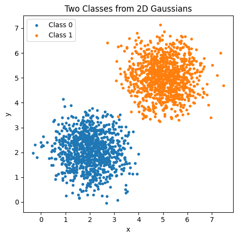
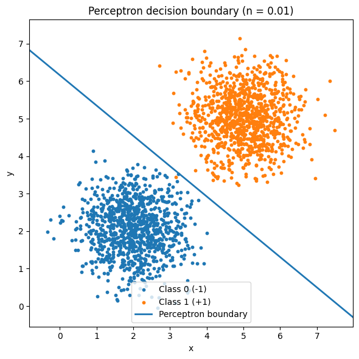
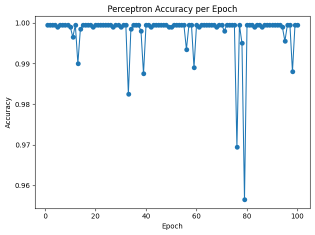
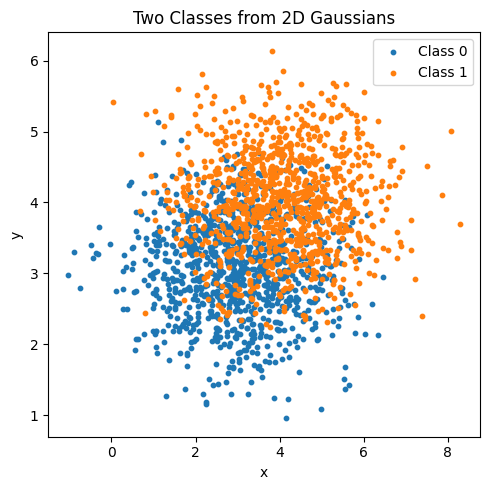
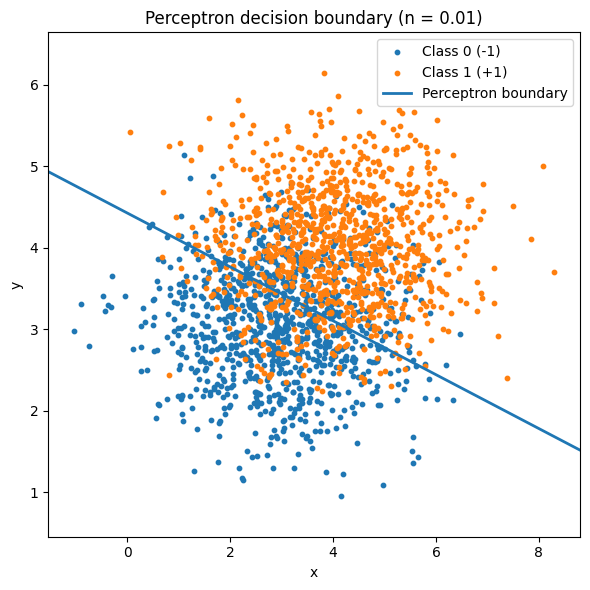
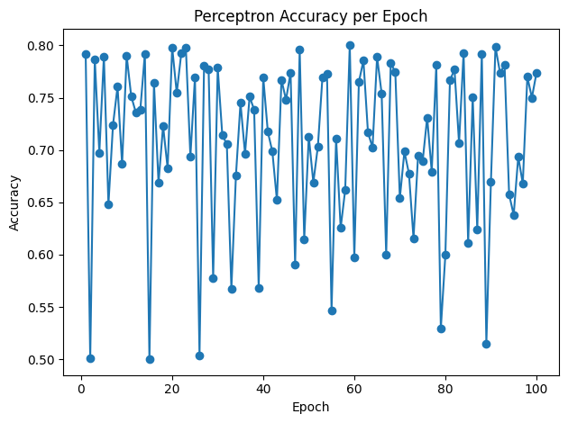

# 2 - Perceptron: Understanding Perceptrons and Their Limitations

This activity is designed to test skills in Perceptrons and their limitations.

## Exercise 1

Start by importing necessary libraries for this project:

<!-- termynal -->

``` bash
pip install matplotlib pandas numpy
```

### Data Generation Task

Generate two classes of 2D data points (1000 samples per class) using multivariate normal distributions. Use the following parameters:

- Class 0:
  - Mean = [2,2]
  
  - Covariance matrix =
    \[
\begin{bmatrix}
0.5 & 0 \\
0 & 0.5
\end{bmatrix}
\]

- Class 1:
  - Mean = [5,5]
  
  - Covariance matrix =
    \[
\begin{bmatrix}
0.5 & 0 \\
0 & 0.5
\end{bmatrix}
\]

```python
# Reproducibility
seed = 120901
rng = np.random.default_rng(seed)


mean0 = np.array([2.0, 2.0])
mean1 = np.array([5.0, 5.0])
cov = np.array([[0.5, 0.0],
                [0.0, 0.5]])

n_per_class = 1000

# Output names
out_prefix = "two_class_data"
csv_path = f"{out_prefix}.csv"
parquet_path = f"{out_prefix}.parquet"

# Generate samples
X0 = rng.multivariate_normal(mean0, cov, size=n_per_class)
X1 = rng.multivariate_normal(mean1, cov, size=n_per_class)

# To DataFrames
df0 = pd.DataFrame(X0, columns=["x", "y"])
df0["class"] = 0

df1 = pd.DataFrame(X1, columns=["x", "y"])
df1["class"] = 1

# Combined dataset
df = pd.concat([df0, df1], ignore_index=True)
df.head()

X = df[["x", "y"]].to_numpy(dtype=float)
y = df["class"].to_numpy(dtype=int)
```

These parameters ensure the classes are mostly linearly separable, with minimal overlap due to the distance between means and low variance. Plot the data points (using libraries like matplotlib if desired) to visualize the separation, coloring points by class.

```python

plt.figure(figsize=(5, 5))
mask0 = df["class"] == 0
mask1 = df["class"] == 1

plt.scatter(df.loc[mask0, "x"], df.loc[mask0, "y"], s=10, label="Class 0")
plt.scatter(df.loc[mask1, "x"], df.loc[mask1, "y"], s=10, label="Class 1")

plt.xlabel("x")
plt.ylabel("y")
plt.title("Two Classes from 2D Gaussians")
plt.legend()
plt.tight_layout()
plt.show()
```


///caption
Plot of classes
///

### Perceptron Implementation Task

Implement a single-layer perceptron from scratch to classify the generated data into the two classes. You may use NumPy only for basic linear algebra operations (e.g., matrix multiplication, vector addition/subtraction, dot products). Do not use any pre-built machine learning libraries (e.g., no scikit-learn) or NumPy functions that directly implement perceptron logic.

- Initialize weights (w) as a 2D vector (plus a bias term b).

```python
y_bin = np.where(y == 1, 1, -1)

w = np.zeros(2, dtype=float)
b = 0.0
n = 0.01

w, b, n
```

- Use the perceptron learning rule

```python
def perceptron_predict_bin(X, w, b):
    a = X @ w + b
    return np.where(a >= 0, 1, -1)  # returns ±1

def accuracy_bin(y_true_bin, y_pred_bin):
    return float((y_true_bin == y_pred_bin).mean())

```

- Train the model until convergence (no weight updates occur in a full pass over the dataset) or for a maximum of 100 epochs, whichever comes first. If convergence is not achieved by 100 epochs, report the accuracy at that point. Track accuracy after each epoch.

```python

def perceptron_train_until_converged(
    X, y_bin, w, b, n=0.01, max_epochs=100, shuffle=True, seed=120901
):
    N = X.shape[0]
    rng = np.random.default_rng(seed)

    acc_history = []
    mistakes_history = []
    epochs_run = 0
    converged = False

    for epoch in range(1, max_epochs + 1):
        if shuffle:
            idx = np.arange(N)
            rng.shuffle(idx)
            Xe, ye = X[idx], y_bin[idx]
        else:
            Xe, ye = X, y_bin

        mistakes = 0

        for xi, yi in zip(Xe, ye):
            a = float(np.dot(w, xi) + b)
            if yi * a <= 0:
                w = w + n * yi * xi
                b = b + n * yi
                mistakes += 1

        # After completing this epoch, compute accuracy on the full dataset
        y_hat = perceptron_predict_bin(X, w, b)
        acc = accuracy_bin(y_bin, y_hat)
        acc_history.append(acc)
        mistakes_history.append(mistakes)

        epochs_run = epoch
        if mistakes == 0:
            converged = True
            break

    return {
        "w": w,
        "b": b,
        "acc_history": acc_history,
        "mistakes_history": mistakes_history,
        "epochs_run": epochs_run,
        "converged": converged,
    }

result = perceptron_train_until_converged(X, y_bin, w, b, n=n, max_epochs=100, shuffle=True, seed=seed)
result["converged"], result["epochs_run"], result["acc_history"][:5], result["mistakes_history"][:5]
```

```python
(False, 100, [0.9995, 0.9995, 0.9995, 0.9995, 0.999], [54, 9, 20, 17, 26])
```

- After training, evaluate accuracy on the full dataset and plot the decision boundary overlaid on the data points. Additionally, plot the training accuracy over epochs to show convergence progress. Highlight any misclassified points in a separate plot or by different markers in the decision boundary plot.

```python
# Use the trained parameters
w_tr, b_tr = result["w"], result["b"]

# Scatter the data
mask0 = (y_bin == -1)
mask1 = (y_bin == 1)

plt.figure(figsize=(6, 6))
plt.scatter(X[mask0, 0], X[mask0, 1], s=10, label="Class 0 (-1)")
plt.scatter(X[mask1, 0], X[mask1, 1], s=10, label="Class 1 (+1)")

# Plot decision boundary
x_min, x_max = X[:, 0].min() - 0.5, X[:, 0].max() + 0.5
y_min, y_max = X[:, 1].min() - 0.5, X[:, 1].max() + 0.5
eps = 1e-12

if abs(w_tr[1]) > eps:
    xs = np.linspace(x_min, x_max, 400)
    ys = -(w_tr[0] * xs + b_tr) / w_tr[1]
    plt.plot(xs, ys, linewidth=2, label="Perceptron boundary")
elif abs(w_tr[0]) > eps:
    # Vertical boundary
    x0 = -b_tr / w_tr[0]
    plt.axvline(x0, linewidth=2, label="Perceptron boundary")
else:
    print("Weights near zero; boundary not defined yet.")

plt.xlim(x_min, x_max)
plt.ylim(y_min, y_max)
plt.xlabel("x")
plt.ylabel("y")
plt.title("Perceptron decision boundary (n = 0.01)")
plt.legend()
plt.tight_layout()
plt.show()
```


/// caption
Plot of perceptron decision boundary
///

The final weights, bias, and accuracy are as follows:

- weight: [0.12208697 0.15098059]
- bias: -0.9300000000000006
- accuracy: 0.9995

Besides that, here is the plot of the Perceptrons accuracy per epoch:


/// caption
Plot of Perceptron Accuracy per epoch
///

The convergence is easier as the points being distributed has low overlap between classes. As such, finding a decision boundary is made simple, even in low epoch counts.

## Excercise 2

### Data Generation Task 2

Generate two classes of 2D data points (1000 samples per class) using multivariate normal distributions. Use the following parameters:

- Class 0:
  - Mean = [3,3]
  
  - Covariance matrix =   \[
\begin{bmatrix}
1.5 & 0 \\
0 & 1.5
\end{bmatrix}
\]

- Class 1:
  - Mean = [4,4]
  
  - Covariance matrix
  \[
\begin{bmatrix}
1.5 & 0 \\
0 & 1.5
\end{bmatrix}
\]


/// caption
Plot of Classes
///

These parameters create partial overlap between classes due to closer means and higher variance, making the data not fully linearly separable.

### Perceptron Implementation Task 2

Using the same implementation guidelines as in Exercise 1, we will train a perceptron on this dataset.

- Follow the same initialization, update rule, and training process.
- Train the model until convergence (no weight updates occur in a full pass over the dataset) or for a maximum of 100 epochs, whichever comes first. If convergence is not achieved by 100 epochs, report the accuracy at that point and note any oscillation in updates; consider reporting the best accuracy achieved over multiple runs (e.g., average over 5 random initializations). Track accuracy after each epoch.
- Evaluate accuracy after training and plot the decision boundary overlaid on the data points. Additionally, plot the training accuracy over epochs to show convergence progress (or lack thereof). Highlight any misclassified points in a separate plot or by different markers in the decision boundary plot.


/// caption
Plot of perceptron decision boundary
///

- As seen above, the decision boundary is not able to separate the data points in a linear fashion. As such, the classes aren't properly separated.


/// caption
Plot of Perceptron accuracy per epoch
///

- Perceptrons accuracy, comparing to it's accuracy in excercise 1, is not as accurate and oscilates between accuracy levels. Overall, the classifying model is less effective here.

The final weights, bias, and accuracy are as follows:

- weight: [0.06873479 0.20793337]
- bias: -0.9200000000000006
- accuracy: 0.7735

As we can see, convergence is not possible in this dataset and 100% accuracy is also impossible.
