# 3 - MLP: Understanding Multi-Layer Perceptrons (MLPs)

This activity is designed to test our skills in Multi-Layer Perceptrons (MLPs).

## Exercise 1: Manual Calculation of MLP Steps

Consider a simple MLP with 2 input features, 1 hidden layer containing 2 neurons, and 1 output neuron. We shall use the hyperbolic tangent (tanh) function as the activation for both the hidden layer and the output layer. The loss function is mean squared error (MSE): L=1/N(y-^y)², where ^y is the networks output.

use the following specific values:

- Input and output vectors:
  - x = [0.5, -0.2]
  - y = 1.0

- Hidden layer weights:
  - W1 = [ [0.3, -0.1] , [0.2, 0.4] ]

- Hidden layer biases:
  - b1 = [0.1 , -0.2]

- Output layer weights:
  - W2 = [0.5 , -0.3]

- Output layer bias:
  - b2 = 0.2

- Learning rate:
  - n = 0.3

- Activation function:
  - tanh
  
### Forward Pass

- Compute the hidden layer pre-activations

```python
z1 = W1 @ x + b1
```

```text
z^(1) = [ 0.27 -0.18]
```

- Apply tanh to get hidden activations

```python
a1 = np.tanh(z1)
```

```text
a^(1) = [ 0.26362484 -0.17808087]
```

- Compute the output pre-activation

```python
z2 = W2 @ a1 + b2
```

```text
z2 = [0.38523668]
```

- Compute the final output

```python
y_hat = np.tanh(z2)
```

```text
y_hat = [0.36724656]
```

### Loss Calculation

- Compute the MSE loss

```python
L = (1/N) * (y - y_hat)**2
```

```text
L = [0.40037691]
```

### Backward Pass (Backpropagation)

Compute the gradients of the loss with respect to all weights and biases. Compute:

- Using tanh derivative

```python
# Backward pass: dL/dy_hat and dL/dz2
dL_dyhat = (2/N) * (y_hat - y)
d_tanh = 1.0 - np.tanh(z2)**2
dL_dz2 = dL_dyhat * d_tanh
```

```text
[-1.26550687]
[0.86512996]
[-1.09482791]
```

- Gradients for output layer, propagate to hidden layer, gradients for hidden layer

```python
# Gradients for output layer
dL_dW2 = dL_dz2 * a1
dL_db2 = dL_dz2

# Propagate to hidden layer
dL_da1 = dL_dz2 * W2
d_tanh1 = 1.0 - np.tanh(z1)**2
dL_dz1 = dL_da1 * d_tanh1

# Gradients for hidden layer
dL_dW1 = np.outer(dL_dz1, x)
dL_db1 = dL_dz1

print("Gradients for output layer:")
print(" dL/dW2 =", dL_dW2)
print(" dL/db2 =", dL_db2)

print("\nPropagated to hidden layer:")
print(" dL/da1 =", dL_da1)
print(" dL/dz1 =", dL_dz1)

print("\nGradients for hidden layer:")
print(" dL/dW1 =\n", dL_dW1)
print(" dL/db1 =", dL_db1)
```

```text
Gradients for output layer:
 dL/dW2 = [-0.28862383  0.19496791]
 dL/db2 = [-1.09482791]

Propagated to hidden layer:
 dL/da1 = [[-0.54741396  0.32844837]]
 dL/dz1 = [[-0.50936975  0.31803236]]

Gradients for hidden layer:
 dL/dW1 =
 [[-0.25468488  0.10187395]
 [ 0.15901618 -0.06360647]]
 dL/db1 = [[-0.50936975  0.31803236]]
```

### Parameter Update

Using the learning rate n = 0.1, update all weights and biases via gradient descent

```python
# Given values
x = np.array([0.5, -0.2])
y = 1.0
W1 = np.array([[0.3, -0.1],
               [0.2, 0.4]])
b1 = np.array([0.1, -0.2])
W2 = np.array([0.5, -0.3])
b2 = 0.2
eta = 0.1  # learning rate

# Forward pass
z1 = W1 @ x + b1
a1 = np.tanh(z1)
z2 = W2 @ a1 + b2
y_hat = np.tanh(z2)

# Backward pass
N = 1
dL_dyhat = (2/N) * (y_hat - y)
d_tanh2 = 1.0 - np.tanh(z2)**2
dL_dz2 = dL_dyhat * d_tanh2

# Gradients for output layer
dL_dW2 = dL_dz2 * a1
dL_db2 = dL_dz2

# Propagate to hidden layer
dL_da1 = dL_dz2 * W2
d_tanh1 = 1.0 - np.tanh(z1)**2
dL_dz1 = dL_da1 * d_tanh1

# Gradients for hidden layer
dL_dW1 = np.outer(dL_dz1, x)
dL_db1 = dL_dz1

# Parameter update
W2_new = W2 - eta * dL_dW2
b2_new = b2 - eta * dL_db2
W1_new = W1 - eta * dL_dW1
b1_new = b1 - eta * dL_db1

print("Updated parameters:")
print("W2 =", W2_new)
print("b2 =", b2_new)
print("W1 =\n", W1_new)
print("b1 =", b1_new)
```

```text
Updated parameters:
W2 = [ 0.52886238 -0.31949679]
b2 = 0.30948279147136
W1 =
 [[ 0.32546849 -0.1101874 ]
 [ 0.18409838  0.40636065]]
b1 = [ 0.15093698 -0.23180324]
```

## Exercise 2: Binary Classification with Synthetic Data and Scratch MLP

Using the make_classification function from scikit-learn, generate a synthetic dataset with the following specifications:

- Number of Samples: 1000
- Number of Classes: 2
- Number of clusters per class: Use the n_clusters_per_class parameter creatively to achieve 1 cluster for one class and 2 for the other (hint: you may need to generate subsets separately and combine them, as the function applies the same number of clusters to all classes by default).
- Other parameters: Set n_features=2 for easy visualization, n_informative=2, n_redundant=0, random_state=42 for reproducibility, and adjust class_sep or flip_y as needed for a challenging but separable dataset.

The code for generating the dataset is as such:

```python
from sklearn.datasets import make_classification
from sklearn.utils import shuffle
import matplotlib.pyplot as plt

# Specs
N = 1000
n0 = N // 2  # class 0 samples
n1 = N - n0  # class 1 samples

# Class 0: 1 cluster
X0, _ = make_classification(
    n_samples=n0,
    n_features=2,
    n_informative=2,
    n_redundant=0,
    n_classes=1,                 # only one class in this subset
    n_clusters_per_class=1,      # 1 cluster
    flip_y=0.0,
    random_state=42
)
y0 = np.zeros(n0, dtype=int)

# Class 1: 2 clusters
X1, _ = make_classification(
    n_samples=n1,
    n_features=2,
    n_informative=2,
    n_redundant=0,
    n_classes=1,                 # only one class in this subset
    n_clusters_per_class=2,      # 2 clusters
    flip_y=0.0,
    random_state=43
)
y1 = np.ones(n1, dtype=int)

# Optional separation tweak: translate class 1 to make boundary challenging but separable
X1 = X1 + np.array([2.0, 0.5])

# Combine and shuffle
X = np.vstack([X0, X1])
y = np.concatenate([y0, y1])
X, y = shuffle(X, y, random_state=42)

# Quick check / visualization
print("Shapes:", X.shape, y.shape)
print("Class counts:", {c: int((y == c).sum()) for c in np.unique(y)})

plt.figure()
plt.scatter(X[y==0,0], X[y==0,1], s=10, label="class 0")
plt.scatter(X[y==1,0], X[y==1,1], s=10, label="class 1")
plt.legend()
plt.title("Synthetic dataset: class 0 (1 cluster) vs class 1 (2 clusters)")
plt.xlabel("x1")
plt.ylabel("x2")
plt.show()
```

The output should look like this:

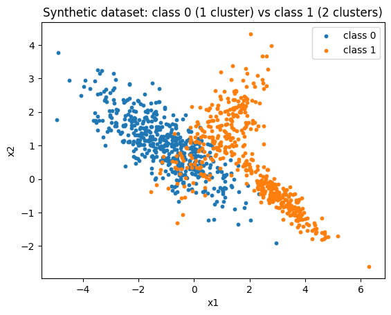
///caption
Synthetic Dataset class 1 and 2
///

Implement an MLP from scratch to classify this data. The architecture chosen for the MLP will be as such:

- Number of hidden layers: 1
- Number of neurons per layer: 2
- Activation function: tanh
- Loss function: binary cross-entropy
- Optimizer: gradient descent, with a learning rate of 0.01

Steps to follow:

- Generate and split the data into training (80%) and testing (20%) sets.
- Implement the forward pass, loss computation, backward pass, and parameter updates in code.
- Train the model for a reasonable number of epochs (e.g., 100-500), tracking training loss.
- Evaluate on the test set: Report accuracy, and optionally plot decision boundaries or confusion matrix.

The code for the steps above is as such

```python
from sklearn.metrics import accuracy_score, confusion_matrix

split = int(0.8 * N)
X_train, y_train = X[:split], y[:split]
X_test, y_test = X[split:], y[split:]

# =========================
# MLP (1 hidden layer, 2 neurons, tanh; BCE loss)
# =========================

def tanh(x):
    return np.tanh(x)

def tanh_deriv(a):
    # assumes a = tanh(z)
    return 1.0 - a**2

def bce_loss_from_probs(p, y_true):
    eps = 1e-12
    p = np.clip(p, eps, 1 - eps)
    return -np.mean(y_true * np.log(p) + (1 - y_true) * np.log(1 - p))

def forward(X, params):
    W1, b1, W2, b2 = params["W1"], params["b1"], params["W2"], params["b2"]
    z1 = X @ W1.T + b1            # (m, 2)
    a1 = tanh(z1)                  # (m, 2)
    z2 = a1 @ W2 + b2              # (m,)
    a2 = tanh(z2)                  # (m,)
    p = (a2 + 1.0) / 2.0           # map tanh -> [0,1]
    cache = {"X": X, "z1": z1, "a1": a1, "z2": z2, "a2": a2, "p": p}
    return p, cache

def backward(y_true, params, cache):
    # Gradients for BCE with p = (tanh(z2)+1)/2
    # dL/dp = (p - y) / (p*(1-p)) averaged over batch
    eps = 1e-12
    p = np.clip(cache["p"], eps, 1 - eps)
    a1, a2, X = cache["a1"], cache["a2"], cache["X"]
    m = X.shape[0]

    dL_dp = (p - y_true) / (p * (1 - p)) / m       # (m,)
    dp_da2 = 0.5
    dL_da2 = dL_dp * dp_da2                         # (m,)
    da2_dz2 = tanh_deriv(a2)
    dL_dz2 = dL_da2 * da2_dz2                       # (m,)

    # Output layer grads
    dW2 = a1.T @ dL_dz2                             # (2,)
    db2 = np.sum(dL_dz2)                            # scalar

    # Backprop to hidden
    dL_da1 = dL_dz2[:, None] * params["W2"][None, :]    # (m,2)
    dL_dz1 = dL_da1 * tanh_deriv(a1)                    # (m,2)
    dW1 = dL_dz1.T @ X                                  # (2,2)
    db1 = np.sum(dL_dz1, axis=0)                        # (2,)

    grads = {"dW1": dW1, "db1": db1, "dW2": dW2, "db2": db2}
    return grads

def update(params, grads, lr):
    params["W1"] -= lr * grads["dW1"]
    params["b1"] -= lr * grads["db1"]
    params["W2"] -= lr * grads["dW2"]
    params["b2"] -= lr * grads["db2"]

# Initialize parameters
rng = np.random.default_rng(0)
params = {
    "W1": rng.normal(scale=0.5, size=(2, 2)),
    "b1": np.zeros(2),
    "W2": rng.normal(scale=0.5, size=2),
    "b2": 0.0,
}

# =========================
# Training
# =========================
lr = 0.01
epochs = 300
loss_hist = []

for ep in range(epochs):
    # forward
    p, cache = forward(X_train, params)
    loss = bce_loss_from_probs(p, y_train)
    loss_hist.append(loss)

    # backward
    grads = backward(y_train, params, cache)

    # update
    update(params, grads, lr)

# =========================
# Evaluation
# =========================
p_test, _ = forward(X_test, params)
y_pred = (p_test >= 0.5).astype(int)
acc = accuracy_score(y_test, y_pred)
cm = confusion_matrix(y_test, y_pred)

print("Test accuracy:", acc)
print("Confusion matrix:\n", cm)
```

With the output

```text
Test accuracy: 0.88
Confusion matrix:
 [[83 18]
 [ 6 93]]
```

The visualizations (code and outputs) are as follows:

```python
# Loss curve
plt.figure()
plt.plot(loss_hist)
plt.xlabel("Epoch")
plt.ylabel("Training BCE loss")
plt.title("Training Loss")

# Decision boundary
def grid_preds(params, xlim, ylim, h=0.02):
    xx, yy = np.meshgrid(
        np.arange(xlim[0], xlim[1], h),
        np.arange(ylim[0], ylim[1], h)
    )
    grid = np.c_[xx.ravel(), yy.ravel()]
    p, _ = forward(grid, params)
    Z = (p >= 0.5).astype(int)
    return xx, yy, Z.reshape(xx.shape)

xlim = (X[:,0].min()-1, X[:,0].max()+1)
ylim = (X[:,1].min()-1, X[:,1].max()+1)
xx, yy, Z = grid_preds(params, xlim, ylim, h=0.03)

plt.figure()
plt.contourf(xx, yy, Z, alpha=0.25, levels=[-0.5,0.5,1.5])
plt.scatter(X_test[y_test==0,0], X_test[y_test==0,1], s=10, label="class 0 (test)")
plt.scatter(X_test[y_test==1,0], X_test[y_test==1,1], s=10, label="class 1 (test)")
plt.title("Decision Boundary (Test Data)")
plt.legend()
plt.xlabel("x1")
plt.ylabel("x2")

# Confusion matrix heatmap (simple text)
plt.figure()
plt.imshow(cm, cmap="Blues")
plt.title("Confusion Matrix")
plt.colorbar()
for i in range(cm.shape[0]):
    for j in range(cm.shape[1]):
        plt.text(j, i, cm[i, j], ha="center", va="center")
plt.xticks([0,1], ["Pred 0", "Pred 1"])
plt.yticks([0,1], ["True 0", "True 1"])

plt.tight_layout()
plt.show()
```

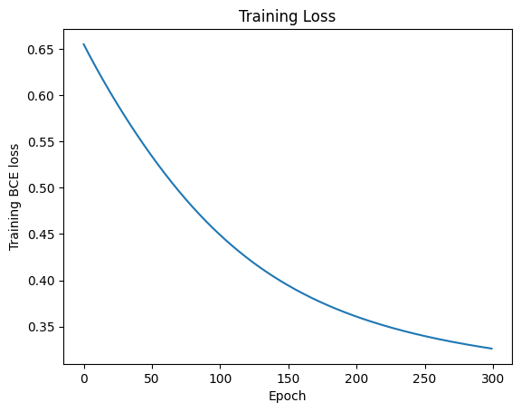
///caption
Training Loss through iterations
///

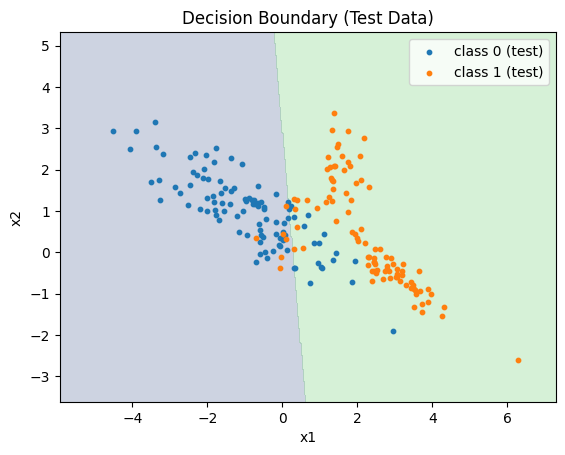
///caption
Decision Boundary of Classes
///

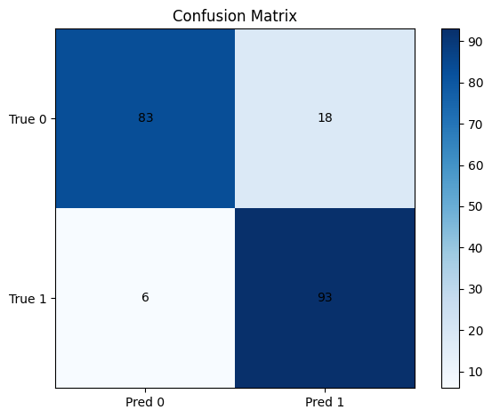
///caption
Confusion Matrix
///

## Exercise 3: Multi-Class Classification with Synthetic Data and Reusable MLP

Use make_classification to generate a synthetic dataset with:

- Number of samples: 1500
- Number of classes: 3
- Number of features: 4
- Number of clusters per class: Achieve 2 clusters for one class, 3 for another, and 4 for the last (again, you may need to generate subsets separately and combine them, as the function doesn't directly support varying clusters per class).
- Other parameters: n_features=4, n_informative=4, n_redundant=0, random_state=42.

Implement an MLP from scratch to classify this data. You may choose the architecture freely, but for an extra point (bringing this exercise to 4 points), reuse the exact same MLP implementation code from Exercise 2, modifying only hyperparameters (e.g., output layer size for 3 classes, loss function to categorical cross-entropy if needed) without changing the core structure.

Steps:

- Generate and split the data (80/20 train/test).
- Train the model, tracking loss.
- Evaluate on test set: Report accuracy, and optionally visualize (e.g., scatter plot of data with predicted labels).

The code for implementing the synthetic dataset above and using an MLP for classification, modifying only hyperparameters and keeping core structure, will look like this:

```python
import numpy as np
from sklearn.datasets import make_classification
from sklearn.utils import shuffle
from sklearn.metrics import accuracy_score, confusion_matrix
import matplotlib.pyplot as plt

# =========================
# 1) Generate dataset
# =========================
np.random.seed(42)
N = 1500
n_per_class = [500, 500, 500]  # 3 classes

# Class 0: 2 clusters
X0, _ = make_classification(
    n_samples=n_per_class[0],
    n_features=4,
    n_informative=4,
    n_redundant=0,
    n_classes=1,
    n_clusters_per_class=2,
    class_sep=1.2,
    flip_y=0.0,
    random_state=42
)
y0 = np.zeros(n_per_class[0], dtype=int)
X0 = X0 + np.array([0.0, 0.0, 0.0, 0.0])

# Class 1: 3 clusters
X1, _ = make_classification(
    n_samples=n_per_class[1],
    n_features=4,
    n_informative=4,
    n_redundant=0,
    n_classes=1,
    n_clusters_per_class=3,
    class_sep=1.0,
    flip_y=0.0,
    random_state=43
)
y1 = np.ones(n_per_class[1], dtype=int)
X1 = X1 + np.array([3.0, -1.0, 0.5, 0.0])

# Class 2: 4 clusters
X2, _ = make_classification(
    n_samples=n_per_class[2],
    n_features=4,
    n_informative=4,
    n_redundant=0,
    n_classes=1,
    n_clusters_per_class=4,
    class_sep=1.0,
    flip_y=0.0,
    random_state=44
)
y2 = np.full(n_per_class[2], 2, dtype=int)
X2 = X2 + np.array([-2.0, 2.0, -0.5, 0.5])

X = np.vstack([X0, X1, X2])
y = np.concatenate([y0, y1, y2])
X, y = shuffle(X, y, random_state=42)

# =========================
# 2) Train / test split
# =========================
split = int(0.8 * N)
X_train, y_train = X[:split], y[:split]
X_test, y_test = X[split:], y[split:]

# =========================
# 3) Reusable MLP (same structure as Exercise 2, adjusted for K=3, softmax + CE)
# =========================
def tanh(x):
    return np.tanh(x)

def tanh_deriv(a):
    return 1.0 - a**2  # assumes a = tanh(z)

def softmax(z):
    z = z - np.max(z, axis=1, keepdims=True)
    ez = np.exp(z)
    return ez / np.sum(ez, axis=1, keepdims=True)

def ce_loss_from_probs(P, Y_onehot):
    eps = 1e-12
    P = np.clip(P, eps, 1 - eps)
    return -np.mean(np.sum(Y_onehot * np.log(P), axis=1))

def one_hot(y, K):
    out = np.zeros((y.size, K))
    out[np.arange(y.size), y] = 1.0
    return out

def forward(X, params):
    W1, b1, W2, b2 = params["W1"], params["b1"], params["W2"], params["b2"]
    z1 = X @ W1.T + b1           # (m, H)
    a1 = tanh(z1)                # (m, H)
    z2 = a1 @ W2 + b2            # (m, K)
    P  = softmax(z2)             # (m, K)
    cache = {"X": X, "z1": z1, "a1": a1, "z2": z2, "P": P}
    return P, cache

def backward(Y_onehot, params, cache):
    X, a1, P = cache["X"], cache["a1"], cache["P"]
    W2 = params["W2"]
    m = X.shape[0]

    dZ2 = (P - Y_onehot) / m         # (m, K)  softmax+CE
    dW2 = a1.T @ dZ2                 # (H, K)
    db2 = np.sum(dZ2, axis=0)        # (K,)

    dA1 = dZ2 @ W2.T                 # (m, H)
    dZ1 = dA1 * tanh_deriv(a1)       # (m, H)
    dW1 = dZ1.T @ X                  # (H, D)
    db1 = np.sum(dZ1, axis=0)        # (H,)

    return {"dW1": dW1, "db1": db1, "dW2": dW2, "db2": db2}

def update(params, grads, lr):
    params["W1"] -= lr * grads["dW1"]
    params["b1"] -= lr * grads["db1"]
    params["W2"] -= lr * grads["dW2"]
    params["b2"] -= lr * grads["db2"]

# Architecture / hyperparams (reusing structure: 1 hidden layer with tanh)
D = X_train.shape[1]
H = 8
K = 3
rng = np.random.default_rng(0)
params = {
    "W1": rng.normal(scale=0.3, size=(H, D)),
    "b1": np.zeros(H),
    "W2": rng.normal(scale=0.3, size=(H, K)),
    "b2": np.zeros(K),
}

lr = 0.01
epochs = 350
loss_hist = []

Ytr = one_hot(y_train, K)

# =========================
# 4) Training
# =========================
for ep in range(epochs):
    P, cache = forward(X_train, params)
    loss = ce_loss_from_probs(P, Ytr)
    loss_hist.append(loss)
    grads = backward(Ytr, params, cache)
    update(params, grads, lr)

# =========================
# 5) Evaluation
# =========================
P_test, _ = forward(X_test, params)
y_pred = np.argmax(P_test, axis=1)
acc = accuracy_score(y_test, y_pred)
cm = confusion_matrix(y_test, y_pred)

print("Test accuracy:", acc)
print("Confusion matrix:\n", cm)
```

And it's output:

```text
Test accuracy: 0.9
Confusion matrix:
 [[ 72   5  13]
 [  1  94   0]
 [ 11   0 104]]
```

And it's outputs will behave as such (code and images):

```python
plt.figure()
plt.imshow(cm, cmap="Blues")
plt.title("Confusion Matrix")
plt.colorbar()

# Annotate cells with values
for i in range(cm.shape[0]):
    for j in range(cm.shape[1]):
        plt.text(j, i, cm[i, j], ha="center", va="center", color="black")

plt.xticks([0,1,2], ["Pred 0", "Pred 1", "Pred 2"])
plt.yticks([0,1,2], ["True 0", "True 1", "True 2"])

plt.tight_layout()
plt.show()
```

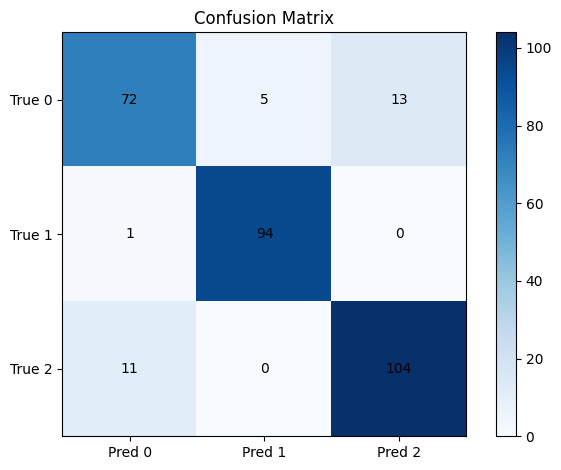
///caption
Confusion Matrix
///

```python
plt.figure()
plt.plot(loss_hist)
plt.xlabel("Epoch")
plt.ylabel("Training CE loss")
plt.title("Training Loss (Multiclass)")

# Simple PCA to 2D for visualization
def pca_2d(X):
    Xc = X - X.mean(axis=0)
    C = np.cov(Xc, rowvar=False)
    eigvals, eigvecs = np.linalg.eigh(C)
    W = eigvecs[:, -2:]  # top-2
    return Xc @ W

X_test_2d = pca_2d(X_test)

plt.figure()
plt.scatter(X_test_2d[:,0], X_test_2d[:,1], c=y_pred, s=12, cmap="tab10", alpha=0.9, edgecolors="none")
plt.title("Test set (predicted labels, PCA 2D)")
plt.xlabel("PC1")
plt.ylabel("PC2")
plt.tight_layout()
plt.show()
```

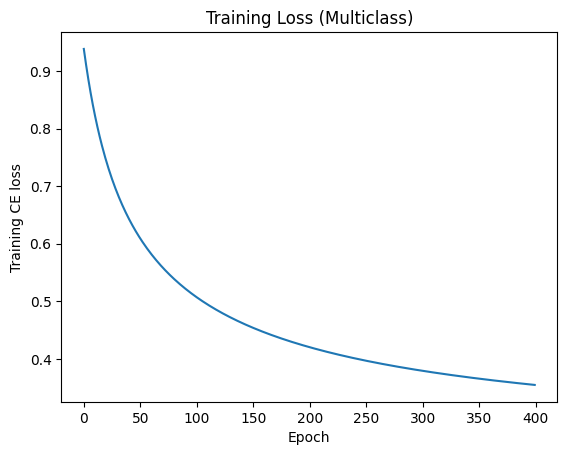
///caption
Training Loss through iterations
///

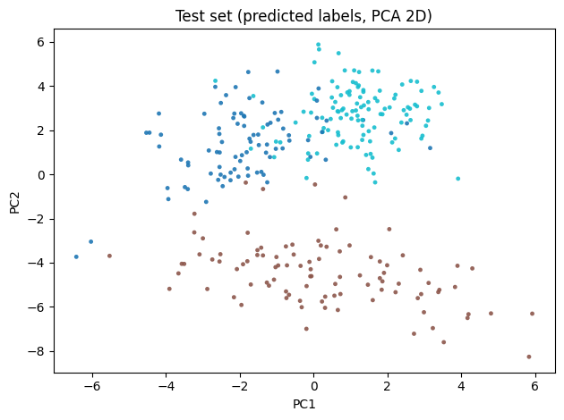
///caption
Synthetic Dataset class 1, 2 and 3
///

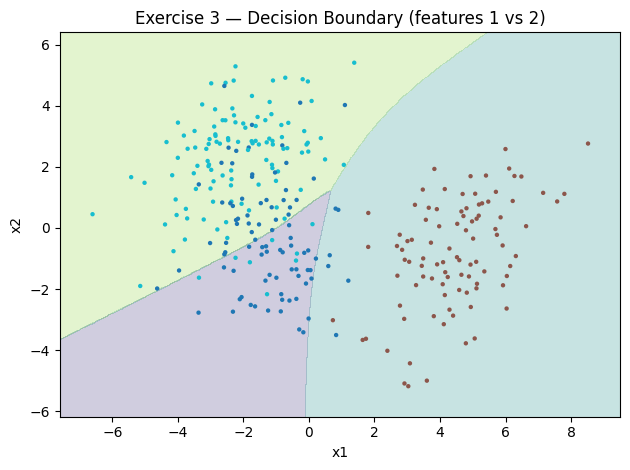
///caption
Decision Boundary of Classes
///

## Exercise 4: Multi-Class Classification with Deeper MLP

Repeat Exercise 3 exactly, but now ensure your MLP has at least 2 hidden layers. You may adjust the number of neurons per layer as needed for better performance. Reuse code from Exercise 3 where possible, but the focus is on demonstrating the deeper architecture. Submit updated code, training results, and test evaluation.

The code for implementation is as such:

```python
import numpy as np
from sklearn.datasets import make_classification
from sklearn.utils import shuffle
from sklearn.metrics import accuracy_score, confusion_matrix
import matplotlib.pyplot as plt

# =========================
# 1) Generate dataset (3 classes, varying clusters: 2, 3, 4)
# =========================
np.random.seed(42)
N = 1800
n_per_class = [600, 600, 600]  # 3 classes

# Class 0: 2 clusters
X0, _ = make_classification(
    n_samples=n_per_class[0],
    n_features=4,
    n_informative=4,
    n_redundant=0,
    n_classes=1,
    n_clusters_per_class=2,
    class_sep=1.2,
    flip_y=0.0,
    random_state=42
)
y0 = np.zeros(n_per_class[0], dtype=int)
X0 = X0 + np.array([0.0, 0.0, 0.0, 0.0])

# Class 1: 3 clusters
X1, _ = make_classification(
    n_samples=n_per_class[1],
    n_features=4,
    n_informative=4,
    n_redundant=0,
    n_classes=1,
    n_clusters_per_class=3,
    class_sep=1.0,
    flip_y=0.0,
    random_state=42
)
y1 = np.ones(n_per_class[1], dtype=int)
X1 = X1 + np.array([3.0, -1.0, 0.5, 0.0])

# Class 2: 4 clusters
X2, _ = make_classification(
    n_samples=n_per_class[2],
    n_features=4,
    n_informative=4,
    n_redundant=0,
    n_classes=1,
    n_clusters_per_class=4,
    class_sep=1.0,
    flip_y=0.0,
    random_state=44
)
y2 = np.full(n_per_class[2], 2, dtype=int)
X2 = X2 + np.array([-2.0, 2.0, -0.5, 0.5])

X = np.vstack([X0, X1, X2])
y = np.concatenate([y0, y1, y2])
X, y = shuffle(X, y, random_state=42)

# =========================
# 2) Train / test split (80/20)
# =========================
split = int(0.8 * N)
X_train, y_train = X[:split], y[:split]
X_test, y_test = X[split:], y[split:]

# =========================
# 3) Deeper MLP (2 hidden layers, tanh; softmax + CE)
# =========================
def tanh(x):
    return np.tanh(x)

def tanh_deriv(a):
    return 1.0 - a**2  # assumes a = tanh(z)

def softmax(z):
    z = z - np.max(z, axis=1, keepdims=True)
    ez = np.exp(z)
    return ez / np.sum(ez, axis=1, keepdims=True)

def ce_loss_from_probs(P, Y_onehot):
    eps = 1e-12
    P = np.clip(P, eps, 1 - eps)
    return -np.mean(np.sum(Y_onehot * np.log(P), axis=1))

def one_hot(y, K):
    out = np.zeros((y.size, K))
    out[np.arange(y.size), y] = 1.0
    return out

def forward(X, params):
    W1, b1 = params["W1"], params["b1"]  # (H1,D), (H1,)
    W2, b2 = params["W2"], params["b2"]  # (H2,H1), (H2,)
    W3, b3 = params["W3"], params["b3"]  # (K,H2), (K,)

    z1 = X @ W1.T + b1               # (m,H1)
    a1 = tanh(z1)                    # (m,H1)
    z2 = a1 @ W2.T + b2              # (m,H2)
    a2 = tanh(z2)                    # (m,H2)
    z3 = a2 @ W3.T + b3              # (m,K)
    P  = softmax(z3)                 # (m,K)

    cache = {"X": X, "z1": z1, "a1": a1, "z2": z2, "a2": a2, "z3": z3, "P": P}
    return P, cache

def backward(Y_onehot, params, cache):
    X, a1, a2, P = cache["X"], cache["a1"], cache["a2"], cache["P"]
    W2, W3 = params["W2"], params["W3"]
    m = X.shape[0]

    # Output layer: softmax + CE
    dZ3 = (P - Y_onehot) / m          # (m,K)
    dW3 = dZ3.T @ a2                  # (K,H2)
    db3 = np.sum(dZ3, axis=0)         # (K,)

    # Hidden layer 2
    dA2 = dZ3 @ W3                    # (m,H2)
    dZ2 = dA2 * tanh_deriv(a2)        # (m,H2)
    dW2 = dZ2.T @ a1                  # (H2,H1)
    db2 = np.sum(dZ2, axis=0)         # (H2,)

    # Hidden layer 1
    dA1 = dZ2 @ W2                    # (m,H1)
    dZ1 = dA1 * tanh_deriv(a1)        # (m,H1)
    dW1 = dZ1.T @ X                   # (H1,D)
    db1 = np.sum(dZ1, axis=0)         # (H1,)

    return {"dW1": dW1, "db1": db1, "dW2": dW2, "db2": db2, "dW3": dW3, "db3": db3}

def update(params, grads, lr):
    params["W1"] -= lr * grads["dW1"]
    params["b1"] -= lr * grads["db1"]
    params["W2"] -= lr * grads["dW2"]
    params["b2"] -= lr * grads["db2"]
    params["W3"] -= lr * grads["dW3"]
    params["b3"] -= lr * grads["db3"]

# Architecture / hyperparams
D = X_train.shape[1]
K = 3
H1 = 16
H2 = 12
rng = np.random.default_rng(0)
params = {
    "W1": rng.normal(scale=0.3, size=(H1, D)),
    "b1": np.zeros(H1),
    "W2": rng.normal(scale=0.3, size=(H2, H1)),
    "b2": np.zeros(H2),
    "W3": rng.normal(scale=0.3, size=(K, H2)),
    "b3": np.zeros(K),
}

lr = 0.01
epochs = 400
loss_hist = []
Ytr = one_hot(y_train, K)

# =========================
# 4) Training
# =========================
for ep in range(epochs):
    P, cache = forward(X_train, params)
    loss = ce_loss_from_probs(P, Ytr)
    loss_hist.append(loss)
    grads = backward(Ytr, params, cache)
    update(params, grads, lr)

# =========================
# 5) Evaluation
# =========================
P_test, _ = forward(X_test, params)
y_pred = np.argmax(P_test, axis=1)
acc = accuracy_score(y_test, y_pred)
cm = confusion_matrix(y_test, y_pred)

print("Test accuracy:", acc)
print("Confusion matrix:\n", cm)
```

```text
Test accuracy: 0.8833333333333333
Confusion matrix:
 [[ 89   4  13]
 [  3 117   0]
 [ 21   1 112]]
```

Visualizations are as follows:

```python
# =========================
# 6) Visualizations
# =========================
# Loss curve
plt.figure()
plt.plot(loss_hist)
plt.xlabel("Epoch")
plt.ylabel("Training CE loss")
plt.title("Training Loss (Multiclass, Deeper MLP)")

# PCA to 2D for visualization of predicted labels
def pca_2d(X):
    Xc = X - X.mean(axis=0)
    C = np.cov(Xc, rowvar=False)
    eigvals, eigvecs = np.linalg.eigh(C)
    W = eigvecs[:, -2:]  # top-2 eigenvectors
    return Xc @ W

X_test_2d = pca_2d(X_test)

plt.figure()
plt.scatter(X_test_2d[:,0], X_test_2d[:,1], c=y_pred, s=12, cmap="tab10", alpha=0.9, edgecolors="none")
plt.title("Test set (predicted labels, PCA 2D)")
plt.xlabel("PC1")
plt.ylabel("PC2")

plt.tight_layout()
plt.show()
```

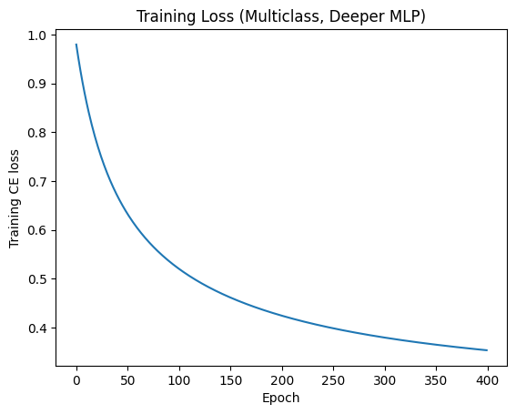
///caption
Training Loss through iterations
///

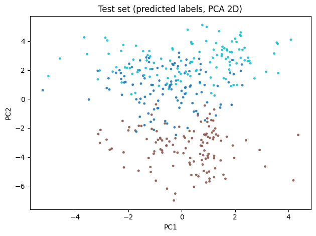
///caption
Synthetic Dataset classes
///

```python
import numpy as np
import matplotlib.pyplot as plt

def decision_boundary_2d(params, forward_fn, X_ref, y_ref=None, feat_idx=(0, 1), h=0.03, title="Decision Boundary"):
    D = X_ref.shape[1]
    f1, f2 = feat_idx

    xlim = (X_ref[:, f1].min() - 1.0, X_ref[:, f1].max() + 1.0)
    ylim = (X_ref[:, f2].min() - 1.0, X_ref[:, f2].max() + 1.0)

    xx, yy = np.meshgrid(
        np.arange(xlim[0], xlim[1], h),
        np.arange(ylim[0], ylim[1], h)
    )
    grid_2d = np.c_[xx.ravel(), yy.ravel()]

    # Fill other features with means from reference set
    means = X_ref.mean(axis=0)
    grid_full = np.tile(means, (grid_2d.shape[0], 1))
    grid_full[:, f1] = grid_2d[:, 0]
    grid_full[:, f2] = grid_2d[:, 1]

    P, _ = forward_fn(grid_full, params)
    if P.ndim == 1:  # binary case with scalar prob
        Z = (P >= 0.5).astype(int)
    else:            # multiclass case with softmax probs
        Z = np.argmax(P, axis=1)

    Z = Z.reshape(xx.shape)

    plt.figure()
    plt.contourf(xx, yy, Z, alpha=0.25, levels=np.arange(Z.max()+2)-0.5)
    if y_ref is not None:
        # plot test/reference points colored by true labels
        plt.scatter(X_ref[:, f1], X_ref[:, f2], c=y_ref, s=10, cmap="tab10", edgecolors="none")
    plt.title(title)
    plt.xlabel(f"x{f1+1}")
    plt.ylabel(f"x{f2+1}")
    plt.tight_layout()
    plt.show()

decision_boundary_2d(params, forward, X_test, y_test, feat_idx=(0, 1), h=0.03, title="Decision Boundary (Test Data, features 1 vs 2)")
```

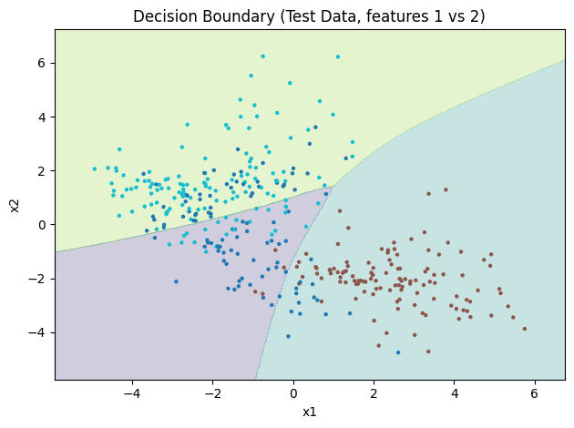
///caption
Decision Boundary of Classes
///

```python
plt.figure()
plt.imshow(cm, cmap="Blues")
plt.title("Confusion Matrix")
plt.colorbar()

# Annotate cells with values
for i in range(cm.shape[0]):
    for j in range(cm.shape[1]):
        plt.text(j, i, cm[i, j], ha="center", va="center", color="black")

plt.xticks([0,1,2], ["Pred 0", "Pred 1", "Pred 2"])
plt.yticks([0,1,2], ["True 0", "True 1", "True 2"])

plt.tight_layout()
plt.show()
```

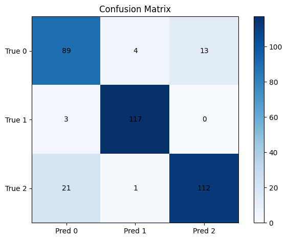
///caption
Confusion Matrix
///
