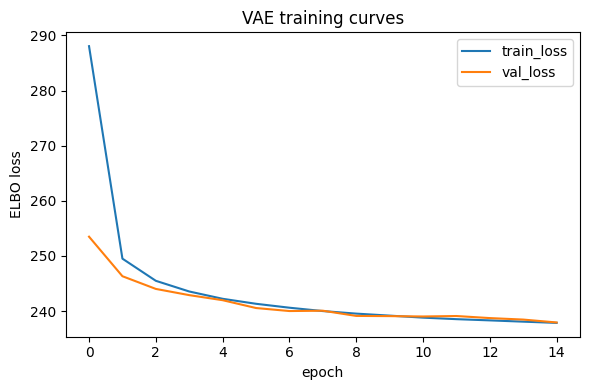
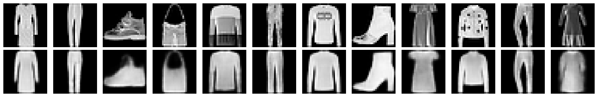
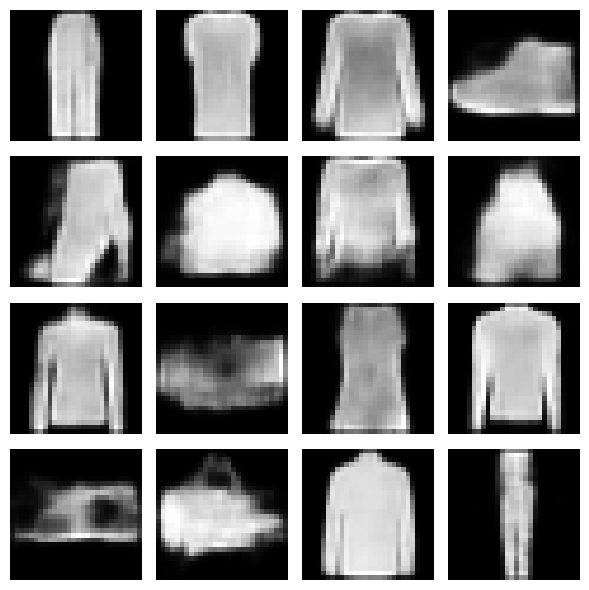
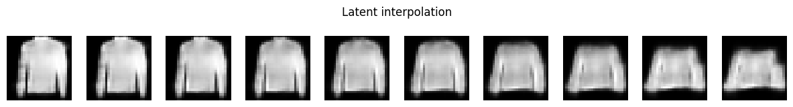
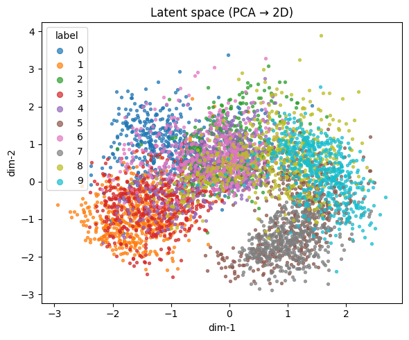

# Variational Autoencoder (VAE) on Fashion-MNIST

Deep Learning – Course Project Report

## 1. Introduction

This project implements a Variational Autoencoder (VAE) trained on the Fashion-MNIST dataset.  
The goal is to learn a compressed latent representation of clothing images that allows:

- Reconstruction of input images
- Generation of new synthetic fashion items
- Continuous interpolation in latent space
- Visualization of learned data clusters

## 2. Model Overview

The VAE consists of two neural networks:

| Component       | Description                                                                                       |
|----------       |---------------------------------------------------------------------------------------------------|
| Encoder         | Convolutional layers followed by fully connected layers to generate mean μ and log-variance logσ² |
| Latent Sampling | Reparameterization trick: z = μ + σ ⊙ ε                                                          |
| Decoder         | Fully connected layer followed by transpose convolutions to reconstruct images                    |

### Latent Variable Sampling

```python
def reparameterize(self, mu, logvar):
    std = torch.exp(0.5 * logvar)
    eps = torch.randn_like(std)
    return mu + eps * std
```

This maintains differentiability required for backpropagation.

## 3. Training Setup

Setting         |Value
Dataset         |Fashion-MNIST (train + validation split)
Input size      |1 × 28 × 28
Latent dimension|20
Loss            |Binary Cross-Entropy (BCE) + KL divergence
Optimizer       |Adam with learning rate 1e-3
Epochs          |15
Batch size      |128

The VAE optimizes the Evidence Lower Bound (ELBO):

𝐿=BCE(𝑥,𝑥^)+𝛽⋅KL(𝑞(𝑧∣𝑥)∥𝑝(𝑧))

where β = 1.0.

## 4. Training Results

Example epoch summary:

```yaml
Epoch 15 | train loss: 237.84 | val loss: 237.92 
```

Interpretation:

- Training and validation metrics are nearly identical → no overfitting
- KL divergence remains non-zero → latent space is being use.
- Visualization of loss curves below.



## 5. Reconstruction Results



Observations:

- Major clothing shapes are preserved
- Blurriness is visible → common trade-off in VAEs
- High-level semantics captured successfully
- Code used to generate reconstructions:

```python
def show_reconstructions(model, dataset, n=8):
    model.eval()
    n = min(n, 16)
    with torch.no_grad():
        x = next(iter(DataLoader(dataset, batch_size=n)))[0].to(device)
        x_hat, _, _, _ = model(x)
    x = x.detach().cpu().numpy()
    x_hat = x_hat.detach().cpu().numpy()
    
    rows = 2
    cols = n
    fig, axes = plt.subplots(rows, cols, figsize=(1.5*cols, 3))
    for i in range(n):
        axes[0, i].imshow(x[i,0], cmap="gray")
        axes[0, i].axis("off")
        axes[1, i].imshow(x_hat[i,0], cmap="gray")
        axes[1, i].axis("off")
    axes[0,0].set_ylabel("Input", rotation=90)
    axes[1,0].set_ylabel("Recon", rotation=90)
    plt.tight_layout()
    plt.show()

show_reconstructions(vae, val_ds, n=8)
```

## 6. Generating New Samples

Random latent vectors generated from:

𝑧∼𝑁(0,𝐼)

Decoded to produce synthetic clothing:



Insight: The model generalizes beyond the training set and can create valid new items.

Code:

```python
def show_samples_from_prior(model, n=16):
    model.eval()
    side = int(math.sqrt(n))
    with torch.no_grad():
        z = torch.randn(n, model.latent_dim, device=device)
        x_hat = model.decode(z).detach().cpu().numpy()
    fig, axes = plt.subplots(side, side, figsize=(1.5*side, 1.5*side))
    idx = 0
    for r in range(side):
        for c in range(side):
            axes[r, c].imshow(x_hat[idx, 0], cmap="gray")
            axes[r, c].axis("off")
            idx += 1
    plt.tight_layout()
    plt.show()

show_samples_from_prior(vae, n=16)
```

## 7. Latent Space Interpolation

Interpolation between two random items to demonstrate smooth transitions:



This indicates the latent space encodes semantic continuity.

Example code:

```python
z1 = torch.randn(1, vae.latent_dim, device=device)
z2 = torch.randn(1, vae.latent_dim, device=device)
alphas = torch.linspace(0, 1, steps=10, device=device).view(-1,1)
z_interp = (1 - alphas) * z1 + alphas * z2
x_hat = vae.decode(z_interp)
```

## 8. Latent Space Visualization

The 20-dimensional latent space was reduced to 2D using PCA:



Findings:

- Clear grouping of visually similar categories
- Items like shirts and pullovers overlap due to similar silhouettes
- More distinct classes such as trousers cluster tightly

## 9. Challenges and Improvements

### Challenges

- Blurry outputs due to balance between KL and reconstruction loss
- Small latent space limits fine detail representation

### Potential Improvements

|Modification                  |Expected Effect                |
|--------------------------------------------------------------|
|Larger latent dimension       |Better detail retention        |
|Skip connections (U-Net style)|Sharper reconstructions        |
|Perceptual or MSE loss        |Improved texture               |
|β-VAE tuning (β < 1)          |Higher fidelity reconstructions|
|Longer training               |Better convergence             |

## 10. Conclusions

This project demonstrates that a convolutional VAE:

- Learns a structured latent representation of clothing
- Generates semantically valid new items
- Reconstructs input images with good shape preservation
- Creates meaningful latent manifolds for clustering and interpolation

Although blurry outputs are a limitation, the VAE shows strong representation learning and generative modeling performance on Fashion-MNIST.
